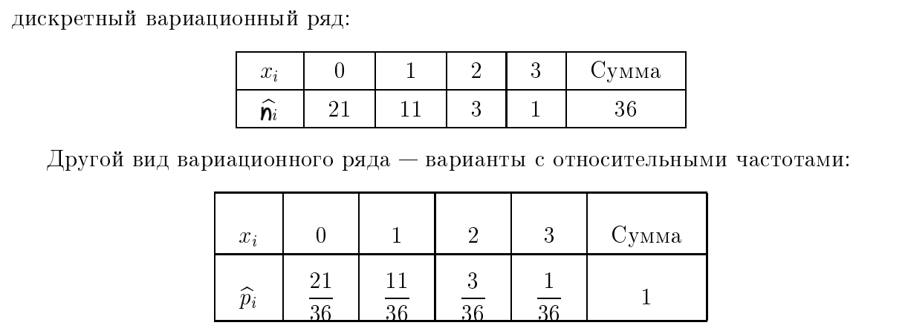
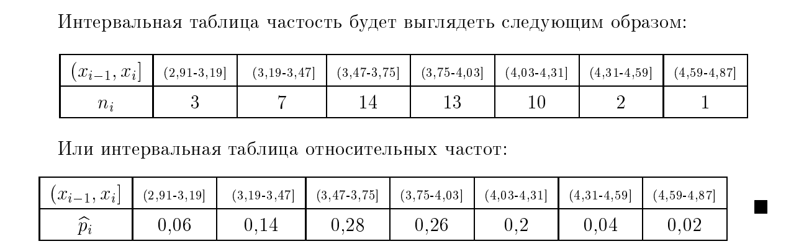
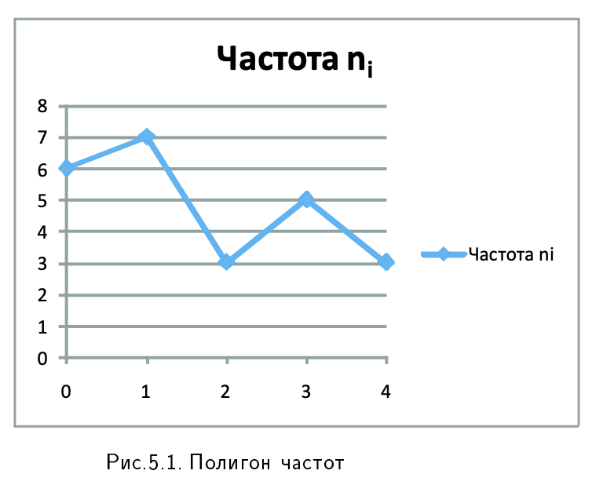
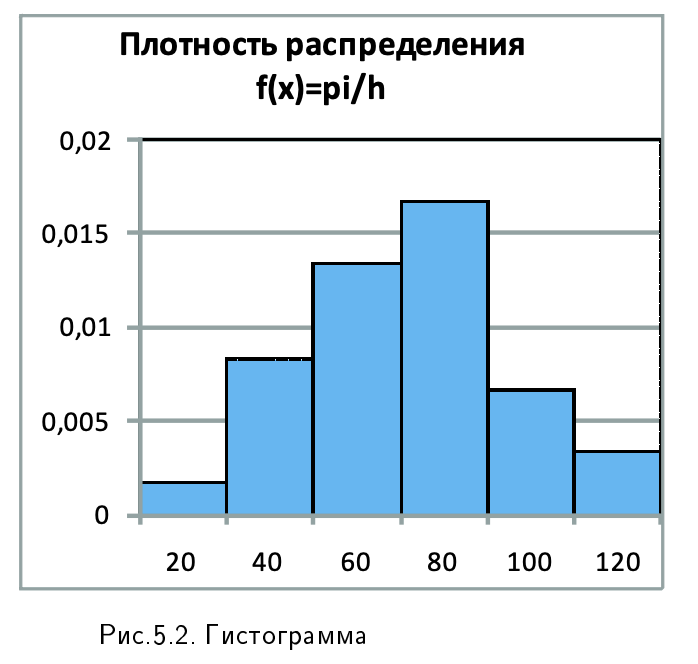

# 1. Вариационный ряд (дискретный и интервальный). Характеристики вариационного ряда: характеристики положения ( среднее арифметическое и его свойства), мода, медиана, показатели вариации (размах варьирования, выборочная дисперсия и ее свойства, коэффициент вариации), асимметрия и эксцесс. Эмпирическая функция распределения. Полигон и гистограмма.

### Вариационный ряд (дискретный и интервальный)

**Вариационный ряд** — это упорядоченная последовательность вариант (значений признака) с соответствующими им частотами или относительными частотами. 

*   **Дискретный вариационный ряд** строится для признаков, принимающих конечное или счетное число значений. Каждому значению $x_i$ соответствует частота $n_i$ (сколько раз это значение встретилось в выборке).
*   **Интервальный вариационный ряд** используется для непрерывных признаков или при большом объеме выборки. Данные разбиваются на интервалы (обычно равной длины $h$), и для каждого интервала подсчитывается количество попадающих в него значений. 
Ширина интервала определяется по формуле: $h = \frac{x_{max} - x_{min}}{k}$, где $k$ — количество интервалов.
### Примеры

#### Характеристики положения
Позволяют определить «центр» распределения.

*   **Среднее арифметическое ($\bar{x}$)** — сумма произведений вариант на их частоты, деленная на объем выборки: $\bar{x} = \frac{\sum x_i n_i}{n}$. 
    *   **Свойства:** 
        1.  **Алгебраическая сумма отклонений** вариант от их среднего значения всегда равна нулю ($\sum (x_i - \bar{x}) n_i = 0$).
        2.  Если все варианты изменить на постоянную величину $C$ (вычесть или прибавить), среднее изменится на ту же величину $C$.
        3.  Если все варианты разделить на число $k$, среднее также уменьшится в $k$ раз.
*   **Мода ($Mo$)** — наиболее часто встречающееся значение в выборке. В интервальном ряду это значение в интервале с наибольшей частотой.
*   **Медиана ($Me$)** — значение признака, которое делит ранжированную выборку на две равные части: у половины объектов значение признака меньше медианы, у другой половины — больше.

#### Показатели вариации
Показывают, насколько сильно данные разбросаны вокруг центра.

*   **Размах варьирования ($R$)** — простейшая мера, разность между самым большим и самым маленьким значениями ($x_{max} - x_{min}$).
*   **Выборочная дисперсия ($D_B$)** — среднее арифметическое квадратов отклонений вариант от выборочного среднего.
    *   **Свойства:** Дисперсия не меняется, если ко всем вариантам прибавить одно и то же число.
    *   **Исправленная дисперсия ($s^2$):** Используется для получения несмещенной оценки генеральной дисперсии, особенно на малых выборках. Она вычисляется как $s^2 = \frac{n}{n-1} D_B$.
*   **Среднее квадратическое отклонение ($\sigma$)** — корень квадратный из дисперсии.
*   **Коэффициент вариации ($V$):** выражает стандартное отклонение в процентах от среднего арифметического: $V = \frac{\sigma}{\bar{x}} \cdot 100\%$. Он позволяет сравнивать изменчивость разных признаков.

#### Асимметрия и эксцесс
Характеризуют форму распределения.

*   **Асимметрия ($As$)** — показатель «скошенности» графика. Если $As > 0$, распределение вытянуто вправо; если $As < 0$ — влево.
*   **Эксцесс ($Ek$)** — показатель «островершинности». Для нормального распределения $Ek = 0$. Если $Ek > 0$, пик графика более острый, чем у нормальной кривой; если $Ek < 0$ — более плоский.

### Графическое представление и функции

*   **Эмпирическая функция распределения $F^*(x)$** — функция, определяющая для каждого значения $x$ относительную частоту события $X < x$. Это ступенчатая функция, которая растет от 0 до 1.
* **Полигон частот** — ломаная линия, соединяющая точки $(x_i, n_i)$, используется для визуализации дискретных рядов.
  
* **Гистограмма** — ступенчатая фигура из прямоугольников для интервального ряда. Площадь каждого прямоугольника равна относительной частоте (или частоте) интервала.
    
---

**Аналогия для запоминания:**
Представь вариационный ряд как **результаты стрельбы по мишени**.
*   **Среднее арифметическое** — это «центр тяжести» всех твоих попаданий.
*   **Мода** — это то конкретное место в мишени, куда ты попадал чаще всего.
*   **Дисперсия** — это твой разброс: насколько кучно лежат пули.
*   **Асимметрия** покажет, есть ли у тебя систематический «занос» руки вправо или влево, а **эксцесс** — насколько предсказуемо ты попадаешь (бьешь ли ты всё время в одну точку или «сеешь» равномерно вокруг центра).