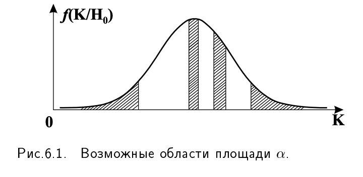
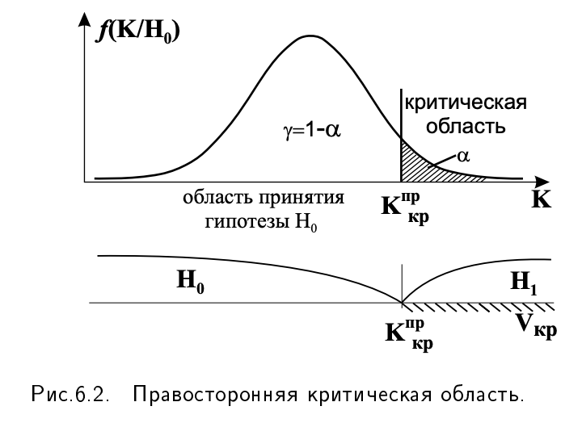
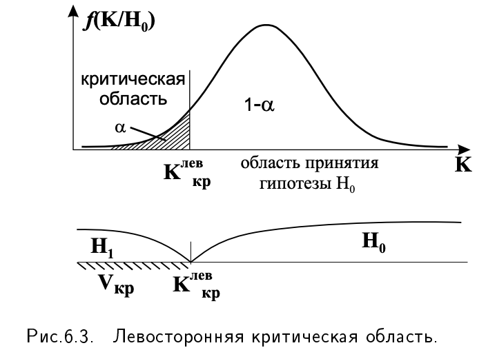
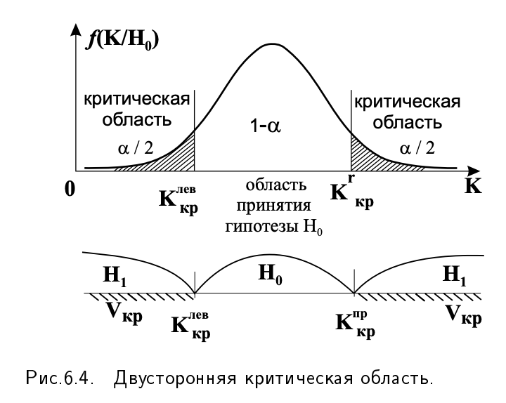

# 10. Статистическая гипотеза и общая схема ее проверки. Ошибки, совершаемые при проверке гипотез. Типы гипотез.

### Статистическая гипотеза
**Определение 6.1.** Статистической гипотезой называется предположение о законе распределения генеральной совокупности (закон неизвестен), либо предположение о значениях неизвестных параметров известного закона распределения, которое проверяется по выборке.

Примеры гипотез: «Генеральная совокупность имеет закон распределения Пуассона», «Генеральное среднее (математическое ожидание) равно 5».

(как в примере выше) статистические гипотезы делятся на **непараметрические**, если в них высказывается предложение о виде закона распределения, и **параметрические**, если в них говорится о значениях параметров известного закона распределения.

#### Гипотеза может быть
- нулевой (проверяемая гипотеза) $H_0$
- альтернативной (логическое отрицание нулевой) $H_1$ (или $H_a$)
- простой (однозначно определяет параметр или распределение) ($H_0$ - всегда простая)
- сложной (множество значений определяет параметр или распределение) ($H_1$ - сложная)
- односторонняя ($H_1$ ограничена с одной стороны: > или <)
- двусторонняя ($H_1$ ограничена с двух сторон знаком $\not =$)

**Определение 6.3.** Гипотеза, являющаяся логическим отрицанием нулевой гипотезы $ H_0 $, называется альтернативной или конкурирующей. Она обозначается $ H_1 $ или $ H_A $.

Нулевая и альтернативная гипотезы представляют собой две возможности выбора, осуществляемого в задачах проверки статистических гипотез.

**Определение 6.4.** Процедура сопоставления высказанной гипотезы $ H_0 $ с выборочными данными называется **проверкой статистической гипотезы**.

Процедура проверки применяется к нулевой гипотезе $ H_0 $. Если в результате проверки оказывается целесообразным отвергнуть гипотезу $ H_0 $, то принимается альтернативная гипотеза $ H_1 $.

**Определение 6.5.** Гипотеза называется простой, если она однозначно определяет параметр или распределение.

Примеры гипотез:

1. $ H_0 : X \sim N(a, \sigma^2) $ - «случайная величина $ X $ подчиняется нормальному закону распределения с параметрами $ a $ и $ \sigma^2 $» — это сложная гипотеза, т.к. под параметрами $ a $ и $ \sigma^2 $ подразумевается любое МНОЖЕСТВО значений.

2. $ H_0 : X \sim N(10, 3^2) $ - «случайная величина $ X $ подчиняется нормальному закону распределения с параметрами $ a = 10 $ и $ \sigma^2 = 3^2 $» — это простая гипотеза, т.к. под параметрами $ a $ и $ \sigma^2 $ подразумеваются КОНКРЕТНЫЕ значения.

Нулевая гипотеза - это всегда простая гипотеза, в ней говорится о конкретных значениях параметров (или распределений). Альтернативная гипотеза сложная, в ней подразумевается бесконечно много возможностей. Если в альтернативной гипотезе о параметрах высказывается ограничение с одной стороны, то гипотеза называется односторонней, если с двух сторон - двусторонней.

#### Пример нулевой и альтернативных параметрических гипотез.

Нулевая гипотеза: «математическое ожидание $a$ генеральной совокупности равно числу $a_0$». Коротко это записывается так: $H_0 : a = a_0$. Возможные для этого случая альтернативные гипотезы:

$$H_1 : a > a_0 \quad \text{правосторонняя}$$

$$H_1 : a < a_0 \quad \text{левосторонняя}$$

$$H_1 : a \neq a_0 \quad \text{двусторонняя}$$

Если высказаны основная и альтернативная гипотезы, то задача состоит в том, чтобы выбрать, какая из них верна.

Здесь на помощь приходит статистический критерий.

**Определение 6.6.** Статистическим критерием
Называют правило, руководствуясь которым принимают решение о справедливости (принятии) или несправедливости (отклонении) нулевой гипотезы на основании результатов выборки.

Статистический критерий должен действовать следующим образом. Все пространство возможных значений исследуемой случайной величины (или некоторой функции от нее) этот критерий должен разбивать на 2 непересекающихся множества. Одна из этих областей называется **доверительной областью**, а другая **критической**. Решение принимается так: если наша выборка (или функция от нее) попадает в доверительную область, то гипотеза $H_0$ принимается, а если в критическую, то принимается альтернативная гипотеза $H_1$.

### Общая схема проверки

##### 1. На основании выборочных данных $x_1, x_2, \ldots, x_n$, исходя из задачи исследования формулируют основную и альтернативную гипотезы

##### 2. Задается уровень значимости (ошибка 1-го рода) $\alpha$

##### 3. Определяется величина $K$, называемая статистикой (критерием), которая удовлетворяет следующим условиям:
   a) $K$ зависит от выборочных данных, т.е. $K = K(x_1, x_2, \ldots, x_n)$;
   b) значения $K$ позволяют судить о «расхождении выборочных данных с гипотезой $H_0$».

##### 4. Определяется, какому закону распределения подчиняется $K(X)$; $K$ — случайная величина (т.к. $x_1, x_2, \ldots, x_n$ - случайные величины), подчиняющаяся при выполнении гипотезы $H_0$ известному закону распределения (Стьюдента, нормальному, Фишера, $\chi^2$ и др.).

**Замечание:** Для каждой из гипотез, которые будем рассматривать, будем использовать доказанные в математической статистике факты — что за статистика должна использоваться и какому закону распределения она подчиняется.

##### 5. Определяются доверительная и критическая $V_{kp}$ области

Область значений случайной величины $K$ разбивается на два непересекающихся подмножества:

a) Вероятность того, что с.в. $K$ примет значение из 1-го множества (при справедливости гипотезы $H_0$) велика. Это область принятия гипотезы.

b) Вероятность того, что с.в. $K$ примет значение из второго множества — мала.

**Определение 6.10.** Критическая область критерия $ K $ — это область, вероятность попадания $ K $ в которую в случае верной гипотезы $ H_0 $ в точности равна уровню значимости $ \alpha $:

$$P(K \in V_{kp}) = \alpha. \quad (*)$$  

Тогда вероятность попадания в доверительную область (область принятия гипотезы $ H_0 $), будет равна

$$P(K \notin V_{kp}) = 1 - \alpha = \gamma$$

Однако критическая область равенством (*) определяется неоднозначно. Действительно, если представить себе график плотности распределения $ f(K) $, то на оси абсцисс существует бесчисленное множество областей-интервалов, таких, что площади, построенных на них криволинейных трапеций, будут равны $\alpha$ (рис. 6.1)

Как же определить критическую область (ее границу)? Так как по значению критерия $K$ судят о «расхождении выборочных данных с гипотезой $H_0$», то $H_0$ должна быть отвергнута, если расхождения велики. Именно этим объясняется включение в критическую область больших значений критерия $K$.

Кроме того, т.к. $K$ — случайная величина, зависящая от результатов выборки $x_1, x_2, \ldots, x_n$, то появление и слишком малых значений должно быть маловероятным. Поэтому в критическую область включаются малые значения критерия.

В зависимости от вида альтернативной гипотезы возможны три вида расположения критических областей – правосторонняя, левосторонняя и двусторонняя.

На рис. 6.2 - 6.4 проиллюстрированы эти области. На каждом из этих рисунков показан график функции плотности вероятности случайной величины $K$ при условии справедливости гипотезы $H_0$, обозначена эта функция $f(K/H_0)$.

a) Правосторонней критической областью называют область, определяемую неравенством $P(K > K_{kp}) = \alpha$, где $K_{kp} = K_{1-\alpha} - (1 - \alpha)$-квантиль распределения $f(K)$. Строятся для альтернативной гипотезы $H_1: a > a_0$.

*<b>Примечание: Квантиль — это граничное значение, которое делит распределение на части с заданными вероятностями.</b>*

б) Левосторонней критической областью называют область, определяемую неравенством $ P(K < K_{kp}) = \alpha $, где $ K_{kp} = K_\alpha - \alpha $-квантиль распределения $ f(K) $. Строится для альтернативной гипотезы $ H_1 : a < a_0 $.

в) Двусторонняя критическая область определяется соотношением $ P(K < K_{kp}^{\text{лев}}) + P(K > K_{kp}^{\text{пр}}) = \alpha $. Предполагая равные вероятности попадания критерия в области малых и больших значений, критические точки для двусторонней критической области будем находить из следующего равенства:

$$P(K < K_{kp}^{\text{лев}}) = P(K > K_{kp}^{\text{пр}}) = \frac{\alpha}{2}.$$

Двусторонняя критическая область строится для альтернативной гипотезы $ H_1: a \neq a_0 $.

Следует заметить, если критерий $ K $ - случайная величина, симметричная относительно оси ординат, то при $ K_{kp} > 0 $ величина $ K_{kp}^{\text{лев}} = -K_{kp} $, а двусторонняя критическая область определяется неравенством $ |K| > K_{kp} $. Тогда

$$P(K < -K_{kp}) = P(K > K_{kp}) = \frac{\alpha}{2}.$$

##### 6. По выборке $ x_1, x_2, \ldots, x_n $ вычисляется наблюдаемое (выборочное) значение критерия $ K_B $

##### 7. Принимается решение:

- если $ K_B \in V_{kp} $, то гипотеза $ H_0 $ отклоняется, как противоречащая опытным данным;

- если $ K_B \notin V_{kp} $, то гипотеза $ H_0 $ принимается.

Принятие гипотезы $ H_0 $ вовсе не означает, что $ H_0 $ является единственно подходящей гипотезой. Это означает лишь, что высказанное в гипотезе предположение не противоречит выборочным данным (опыту).

### Типы статистических гипотез
По своему прикладному содержанию статистические гипотезы можно подразделить на несколько основных типов:

- о числовых значениях параметров;

- о равенстве числовых характеристик генеральных совокупностей;

- о законе распределения;

- об однородности выборок (т.е. принадлежности их одной и той же генеральной совокупности);

- о статистической независимости элементов выборки.

### Ошибки, совершаемые при проверке гипотез

**Определение 6.7.** Ошибкой первого рода называется ошибка отклонения верной гипотезы. Вероятность этой ошибки равна вероятности попадания случайной величины в критическую область, ее обозначают $\alpha$:

$$\alpha = P(H_0 \text{ отклоняется} / \text{при условии } H_0 \text{ верна})$$

**Определение 6.8.** Ошибкой второго рода называется ошибка принятия ложной гипотезы $H_0$, ее обозначают $\beta$:

$$\beta = P(H_0 \text{ принимается} / \text{при условии } H_0 \text{ ложна})$$

Чтобы найти вероятность ошибки второго рода, нужно знать закон распределения случайной величины в предположении справедливости альтернативной гипотезы $H_1$. Тогда искомая вероятность равна вероятности попадания случайной величины в область принятия гипотезы $H_0$.

Вероятность $\alpha$ называется **уровнем значимости**.

Хотелось бы, чтобы оба типа ошибок были как можно меньше. Однако эти ошибки взаимосвязаны: уменьшение одной из них приводит к увеличению другой (на выборке одного объема).

Для того, чтобы выйти из этой ситуации поступают следующим образом. Исследователь сам задает допустимую ошибку 1-го рода $\alpha$, обычно это малая величина: $\alpha = 0,05; 0,01; 0,001$. Далее при этом фиксированном уровне значимости строят такой критерий, чтобы ошибка второго рода $\beta$ была минимальной.

В результате проверки гипотезы $H_0$ может быть принято и верное решение:

1. Гипотеза $H_0$ принимается, тогда как $H_0$ является истинной. Вероятность этого решения $P(H_0/H_0 \text{ истинна}) = 1 - \alpha$.

2. Гипотеза $H_0$ отклоняется (принимается $H_1$), тогда как $H_0$ является ложной. Вероятность этого решения $P(H_1/H_0 \text{ ложна}) = 1 - \beta$.

| Верна ли $ H_0 $ | Решение    |    |
|---|---|---|
| $ H_0 $ верна    | $ P(H_1/H_0) = \alpha $  | $ P(H_0/H_0) = 1 - \alpha $ |
|    | ошибка 1-го рода   | правильное решение    |
| $ H_0 $ ложна    | $ P(H_1/H_1) = 1 - \beta $ | $ P(H_0/H_1) = \beta $ |
|    | правильное решение | ошибка 2-го рода    |

В таблице в скобках на первом месте указана принимаемая гипотеза, а через дробь (условие) - истинная гипотеза.

#### примечание (можно рассмотреть на примере теста на беременность):

|Реальность:      | Тест показал "+"   |    Тест показал "-"|
|---|---|---|
|H0: Беременности нет | Ложноположительный |   Правильный     |
|                |   (α = 0.01)       |  (1-α = 0.99)    |
|H1: Беременность есть|   Правильный       | Ложноотрицательный|
|                 |  (мощность = 0.99) |   (β = 0.01)     |

***из МЛ еще можно почитать про precision / recall и TP / FN (True positive , False negative сценарии для лучшего понимания) [Статья](https://habr.com/ru/articles/661119/)***

**Определение 6.9.** Мощностью критерия называется вероятность несовершения ошибки второго рода:

$$M = 1 - \beta,$$

т.е. вероятность принятия альтернативной гипотезы, когда она верна.

Эта величина является инструментом для сравнения статистических критериев. Чем больше мощность критерия, тем меньше ошибка второго рода $\beta$.
