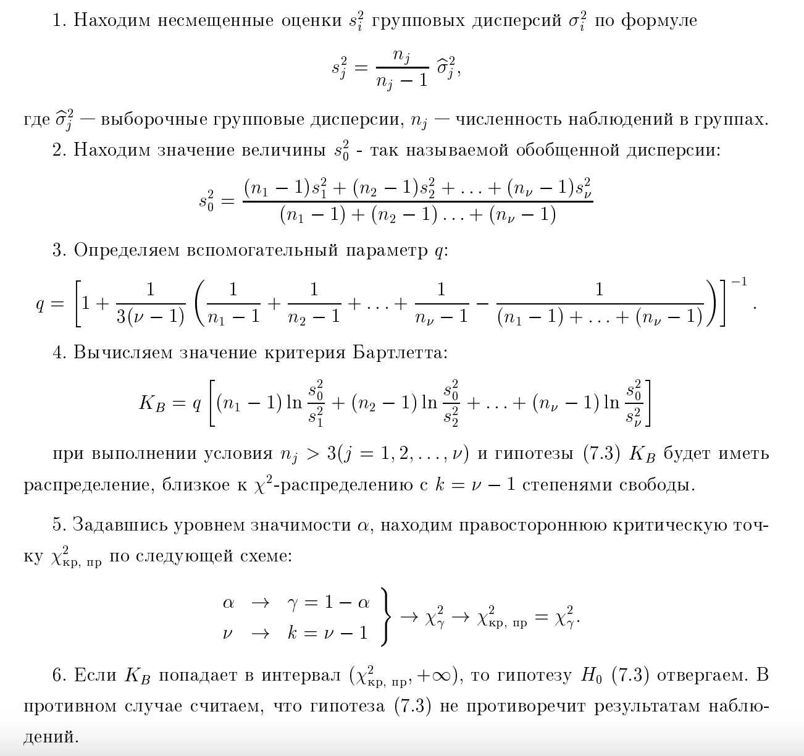

# 13. Дисперсионный анализ. Критерий Бартлетта (проверяемая гипотеза и используемое распределение).

**Дисперсионный анализ** основывается на ряде допущений, одним из которых является **гомоскедастичность** — равенство (однородность) дисперсий в сравниваемых группах. 

**Критерий Бартлетта** используется для проверки этого условия, когда количество групп $k > 2$.

### Проверяемая гипотеза
Критерий Бартлетта проверяет гипотезу о равенстве дисперсий нескольких выборок, извлеченных из нормальных популяций.

*   **Нулевая гипотеза ($H_0$):** Дисперсии во всех группах равны между собой:
    $$H_0: \sigma_1^2 = \sigma_2^2 = \dots = \sigma_k^2$$
*   **Альтернативная гипотеза ($H_1$):** Хотя бы две дисперсии значимо различаются (нарушение однородности).

### Алгоритм применения
