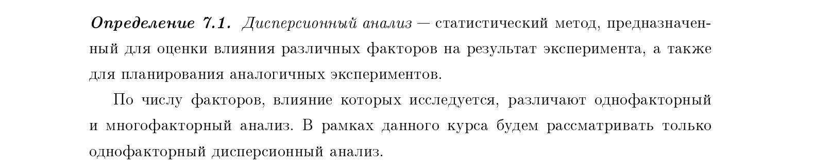

# 13. Дисперсионный анализ. Критерий Бартлетта (проверяемая гипотеза и используемое распределение).
**Дисперсионный анализ**

**Основные понятия:**
- **Фактор** – это независимая переменная (например, вид удобрения, метод обучения, тип лекарства), влияние которой на зависимую переменную мы изучаем.
- **Уровни фактора** – это различные значения или категории фактора (например, три разных дозы удобрения, четыре метода обучения, две марки лекарства).
- **Цель дисперсионного анализа** – проверить, оказывают ли разные уровни фактора статистически значимое влияние на среднее значение зависимой переменной.

**Зачем нужно требование равенства дисперсий?**  
Дисперсионный анализ строится на предположении, что **остатки модели (разности между наблюдаемыми и предсказанными значениями) распределены нормально с одинаковой дисперсией**:

$$
\varepsilon_{ij} \sim N(0, \sigma^2),
$$

где $\sigma^2$ – общая дисперсия ошибок для всех групп.

**Зачем нужно равенство дисперсий в дисперсионном анализе? Обоснование подробно**

Дисперсионный анализ (ANOVA) основан на **модели**:

$$
y_{ij} = \mu + \tau_i + \varepsilon_{ij},
$$
где:
- $ y_{ij} $ — наблюдаемое значение в $i$-й группе,
- $ \mu $ — общее среднее,
- $ \tau_i $ — эффект $i$-го уровня фактора,
- $ \varepsilon_{ij} $ — случайная ошибка.

**Ключевое предположение:** ошибки $ \varepsilon_{ij} $ независимы и имеют **одинаковое нормальное распределение**:
$$
\varepsilon_{ij} \sim N(0, \sigma^2),
$$
где $\sigma^2$ — одна и та же дисперсия для **всех групп**.

---

### Что происходит, если дисперсии не равны (гетероскедастичность)?

#### 1. **Нарушается точность F-критерия**
В ANOVA для проверки гипотезы $H_0: \tau_1 = \tau_2 = \dots = \tau_k$ используется **F-статистика**:
$$
F = \frac{MS_{\text{между}}}{MS_{\text{внутри}}},
$$
где $MS_{\text{внутри}}$ — средний квадрат внутри групп (оценка общей дисперсии $\sigma^2$).

**Если дисперсии разные**, то $MS_{\text{внутри}}$ перестаёт быть хорошей оценкой **одной** общей дисперсии. В результате:
- **Распределение F-статистики отклоняется от теоретического F-распределения** (Фишера).
- **Фактический уровень значимости** перестаёт соответствовать номинальному (например, выбранному $\alpha = 0.05$).

#### 2. **Возрастает вероятность ошибок I и II рода**

- **Ошибка I рода (ложное обнаружение эффекта)** — когда мы отвергаем $H_0$, хотя на самом деле различий между группами нет.
    - При неравных дисперсиях F-критерий может стать **либеральным**: он будет чаще отвергать $H_0$, чем следует.
    - **Пример:** Если в группах с маленькой дисперсией случайно оказались крайние значения, F-статистика может искусственно завыситься.

- **Ошибка II рода (пропуск эффекта)** — когда мы не отвергаем $H_0$, хотя реальные различия есть.
    - При неравных дисперсиях F-критерий может стать **консервативным**: он будет реже обнаруживать реальные эффекты.
    - **Пример:** Если в группах с большим разбросом "шум" маскирует систематические различия, мощность критерия падает.

#### 3. **Искажение доверительных интервалов**
Доверительные интервалы для средних или разностей средних строятся в предположении общей дисперсии. При гетероскедастичности:
- Интервалы становятся **уже или шире**, чем должны быть.
- **Уровень доверия** (например, 95%) не соблюдается.

---

### Почему это важно для практики?
- Если вы сравниваете эффективность трёх лекарств, но в одной группе пациенты сильно различаются по реакции (большая дисперсия), а в других — нет, то:
    - Вы можете сделать **неверный вывод**, что лекарства действуют по-разному (ошибка I рода).
    - Или наоборот, **не заметить** реальную разницу (ошибка II рода).

Поэтому **перед применением дисперсионного анализа необходимо проверять гипотезу о равенстве дисперсий**, например, с помощью **критерия Бартлетта** (для нормальных данных) или **критерия Левена** (более устойчивого к отклонениям от нормальности).

---

**Критерий Бартлетта** используется для проверки этого условия, когда количество групп $k > 2$.

### Проверяемая гипотеза
Критерий Бартлетта проверяет гипотезу о равенстве дисперсий нескольких выборок, извлеченных из нормальных популяций.

*   **Нулевая гипотеза ($H_0$):** Дисперсии во всех группах равны между собой:
    $$H_0: \sigma_1^2 = \sigma_2^2 = \dots = \sigma_k^2$$
*   **Альтернативная гипотеза ($H_1$):** Хотя бы две дисперсии значимо различаются (нарушение однородности).

### Алгоритм применения
