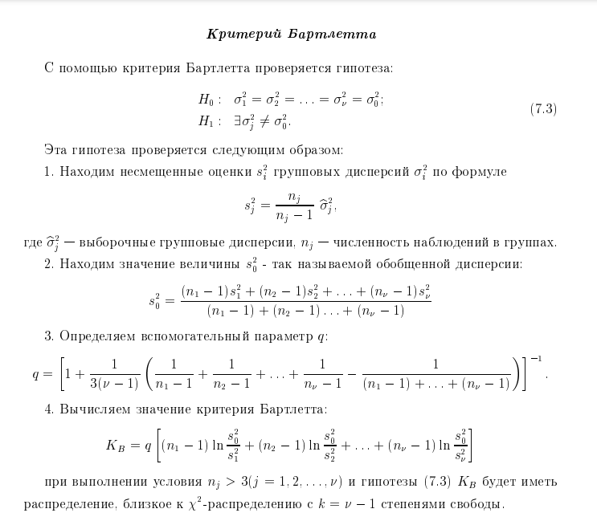
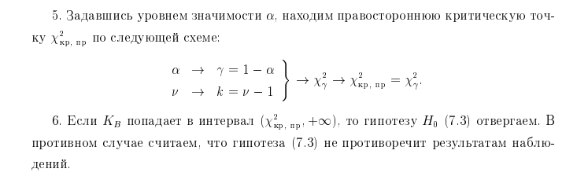
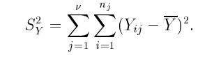
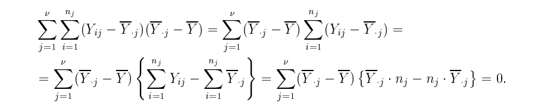
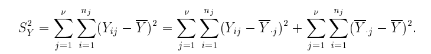
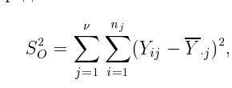
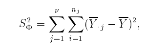

# 14. Разложение дисперсии результативного признака в дисперсионном анализе. Дисперсионная таблица. Проверка гипотезы о равенстве групповых математичнских ожиданий (гипотеза, используемая статистика, критерий). Модель однофакторного дисперсионного анализа.

чуточку определений

### ОПР(Дисперсионный анализ)

**Дисперсионный анализ** - статистический метод, предназначенный для оценки влияния различных факторов на результат эксперимента, а также планнирования аналогичных экспериментов. По кол-ву факторов можно определить:
* Однофакторный Дисперсионный анализ (только его рассматриваем)
* Многофакторный Дисперсионный анализ

### ОПР(Фактор)

**Фактор** - это не случайная переменная, влияющая на результат

### ОПР(Уровень фактора)

**Уровень фактора** - это конкретное значение фактора

* В качестве значения может быть количественная(кол-во работяг в команде) либо качественная переменная(тип бригады, вид упаковки)

### ОПР(Отклик)

**Отклик** - это значение измеряемого признака(результата)

### Модель однофакторного дисперсионного анализа

Модель однофакторного дисперсионного анализа имеет вид:

$$Y_{i,j} = \mu + \tau_{j} + \varepsilon{i,j}$$

где:
* $i \in \{1,2,...n\}$ - номер наблюдения наблюдений
* $j \in \{1,2, ... \nu\}$ - номер фактора
* $Y_{i,j}$ - значение отклика для для i-ого наблюдения и j-ого фактора
* $\mu$ - общеее среднее отклика
  * $\mu = \bar{Y} = \frac{1}{n} \cdot \sum_{j=1}^{\nu}[\sum_{i=1}^{n} Y_{i,j}] = \frac{1}{\nu}\cdot \sum_{j=1}^{\nu} \frac{1}{n_j}\cdot [\sum_{i=1}^{n_j} Y_{i,j}] = \frac{1}{\nu}\sum_{j=1}^{\nu}\bar{Y}_{.j}$
  * Если по-человечески это просто средние число отклика для всех наблюдений
* $\tau_j$ - отклонение от общего среднего, вызванное изменением уровня фактора
* $\varepsilon_{i,j}$ - случайная компонента, вызванная влиянением не рассмотренных факторов
  * Условно мы изучаем продолжительность жизни людей и в качестве фактора выбрали курение, т.е курит он или нет
    * Т.К не только курение влияет на продолжительность жизни, но и много других факторов, то предположу, что $\varepsilon_{i,j}$ будет довольно большой

Определив всё это добро, теперь приступаем к сути - к доказанию гиппотезы:
* $H_0$: $\tau_1 = \tau_2 = ... = \tau_{\nu} = 0$
  * т.е факторы не оказывают никакого влияния, средние значения во всех группах одинаковые и различия данных вызваны лишь случайностью
* $H_1$: $\exist \tau_{j} \neq 0$
  * Найдётся какой-то фактор, оказывающий влияние на данные

**Перед проведением анализа нужно убедиться:**
* Все наблюдения - независимы
* Ошибки подчиняются нормальному закону 
  * $\varepsilon_{i,j} \thicksim N(0, \sigma^2)$
* Дисперсия для разных уровней фактора постоянна
  * $\sigma_{1}^2 = \sigma_{2}^2 = ... = \sigma_{\nu}^2 = const$

Без этого анализ не даст точных результатов

С дисперсиями разбираемся с помощью критерия Бартлета(это не мой билет, поэтому просто скрины)

### Основное дисперсионное равенство

Понадобится, чтобы доказать, что средния значения в группах с разными уровнями фактора одинаковы

Для этого:
1. Найдем 
   1. 
   2. $\bar{Y}$ - это среднее среди всех значений
2. затем внутри суммы прибавим 0 ($+\bar{Y}_{.j} - \bar{Y}_{.j}$)
   1. 
3. Оказывается, что слагаемое $2(Y_{i,j}-\bar{Y}_{.j})(\bar{Y}_{.j} - \bar{Y}) = 0$ 
   1. 
4. Получаем
   1. 

Слагамое  - характеризует вариацию признака внутри группы

Слагаемое  - характеризует вариацию признака между группами

Таким образом получаем основное дисперсионное р-во:

$$S_Y^2 = S_O^2+ S_{Ф}^2$$