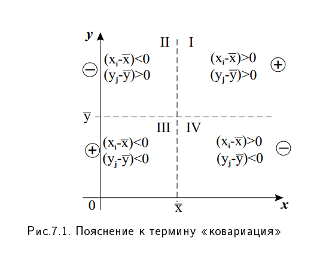
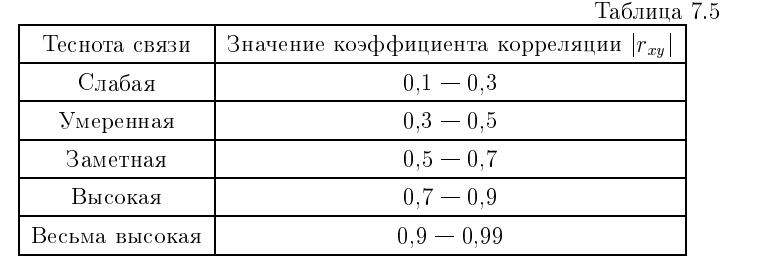

# 15. Функциональная, корреляционная и статистическая зависимости. Ковариация и корреляция (определения, свойства – с доказательством)

В статистике и теории вероятностей выделяют три основных вида связи между случайными величинами $X$ и $Y$.

### 1. Виды зависимостей между переменными

*   **Функциональная зависимость:** Самый строгий вид связи, при котором каждому значению переменной $X$ соответствует ровно одно определенное значение переменной $Y$. В общем виде записывается уравнением $Y = f(X)$. Пример: \(S=\pi r^{2}\).
*   **Статистическая зависимость:** Более общая форма связи, при которой изменение одной величины ($X$) влечет за собой изменение **закона распределения** другой величины ($Y$). Это означает, что при фиксированном $x$ величина $Y$ остается случайной, но ее возможные значения и их вероятности меняются в зависимости от $x$.
*   **Корреляционная зависимость:** частный случай статистической связи, при которой изменение значения $X$ приводит к изменению **среднего значения** (математического ожидания) величины $Y$. Она выражается через функции регрессии: $M(Y|X=x) = f(x)$ или $M(X|Y=y) = \varphi(y)$.

---

### 2. Ковариация (корреляционный момент)

**Ковариацией** $cov(X, Y)$ (или корреляционным моментом $K_{xy}$) называется математическое ожидание произведения отклонений случайных величин от их математических ожиданий.

#### Формулы ковариации:
1. **Теоретическая (по определению):**
$$cov(X, Y) = M[(X - M(X))(Y - M(Y))]$$

2. **Эмпирическая (через сумму для выборки):**
Для выборки объема $n$ ковариация рассчитывается как:
$$cov(X, Y) = \frac{\sum_{i=1}^{n} (x_i - \bar{x})(y_i - \bar{y})}{n}$$

3. **Расчетная формула:**
$$cov(X, Y) = M(XY) - M(X)M(Y)$$

**Доказательство расчетной формулы:**
Исходя из определения ковариации и используя свойство линейности математического ожидания:
1. Разложим произведение под знаком $M$:
$$cov(X, Y) = M[XY - X \cdot M(Y) - Y \cdot M(X) + M(X)M(Y)]$$
2. Применим свойства математического ожидания (вынося постоянные $M(X)$ и $M(Y)$ за знак ожидания, т.к. $M(M(X)) -$ это константы):
$$cov(X, Y) = M(XY) - M(X) \cdot M(Y) - M(Y) \cdot M(X) + M(X)M(Y)$$
3. После сокращения подобных слагаемых получаем:
$$cov(X, Y) = M(XY) - M(X)M(Y)$$

#### Свойства ковариации и доказательства:

0. **Линейность:** \(\mathrm{cov}(X,U+V)=\mathrm{cov}(X,U)+\mathrm{cov}(X,V)\)
1.  **Симметричность:** $cov(X, Y) = cov(Y, X)$.
2.  **Вынос константы:** $cov(kX, Y) = k \cdot cov(X, Y)$.
3.  **Ковариация с константой:** $cov(X, C) = 0$.
4.  **Связь с дисперсией:** $cov(X, X) = D(X)$.
    *   **Доказательство:** $cov(X, X) = M[(X - M(X))(X - M(X))] = M[(X - M(X))^2] = D(X)$.
5.  **Дисперсия суммы и разности:**
$$D(X \pm Y) = D(X) + D(Y) \pm 2cov(X, Y)$$
    *   **Доказательство (для суммы):**
        $$D(X+Y) = M[((X+Y) - M(X+Y))^2] = M[((X - M(X)) + (Y - M(Y)))^2]$$
        Раскроем квадрат суммы:
        $$D(X+Y) = M[(X - M(X))^2 + (Y - M(Y))^2 + 2(X - M(X))(Y - M(Y))]$$
        Применяя линейность математического ожидания:
        $$D(X+Y) = M[(X - M(X))^2] + M[(Y - M(Y))^2] + 2M[(X - M(X))(Y - M(Y))]$$
        По определениям дисперсии и ковариации:
        $$D(X+Y) = D(X) + D(Y) + 2cov(X, Y)$$

Ковариация характеризует как силу связи, так и её направление: если $cov(X, Y) > 0$, величины имеют тенденцию возрастать или убывать **одновременно**; если $cov(X, Y) < 0$ — при возрастании одной величины другая убывает.

---

### 3. Коэффициент корреляции

**Определение:** Коэффициентом корреляции Пирсона $r_{xy}$ называется безразмерная величина, характеризующая тесноту **линейной** связи между переменными:
$$r_{xy} = \frac{cov(X, Y)}{\sigma_x \sigma_y} = \frac{cov(X, Y)}{\sqrt{D(X)} \sqrt{D(Y)}}$$

#### Свойства коэффициента корреляции:

1.  **Ограниченность:** $-1 \le r_{xy} \le 1$.
    *   Если $|r_{xy}| = 1$, то между переменными существует строгая **линейная функциональная зависимость**.
2.  **Независимость и корреляция:** Если $X$ и $Y$ независимы, то $r_{xy} = 0$.
    *   Важно: Если $r_{xy} = 0$, величины называются **некоррелированными**. Это гарантирует **отсутствие линейной связи**, но между ними всё ещё может существовать сильная **нелинейная зависимость**.
3.  **Инвариантность:** Значение $r_{xy}$ не меняется при изменении единиц измерения или масштаба переменных, так как оно является нормированным значением ковариации.
4.  **Направление связи:** если $r_{xy} > 0$, связь прямая; если $r_{xy} < 0$, связь обратная.

---
**Аналогия:**
* Ковариация — это как наблюдение за направлением движения двух велосипедистов.
    * Если оба едут вперед или оба назад, ковариация положительна — они движутся в одном направлении.
    * Если один едет вперед, а другой назад, ковариация отрицательна — они движутся в противоположных направлениях.
    * Проблема в том, что по значению ковариации (например, 10 или 1000) вы не можете сказать, насколько быстро или синхронно они едут, так как это значение зависит от их скорости и единиц измерения (км/ч, мили/ч и т.д.).
* Коэффициент корреляции — это как оценка того, насколько велосипедисты привязаны друг к другу невидимой резинкой.
    * Коэффициент корреляции **нормирует** (переводит в стандартную шкалу) это движение, давая четкое понимание силы и последовательности связи.
    * Значение **+1** означает, что они движутся абсолютно синхронно, как будто их велосипеды жестко соединены.
    * Значение **-1** означает идеальную синхронность, но в противоположных направлениях.
    * Значение **0** означает, что связи нет вообще, и их движение никак не зависит друг от друга (они могут ехать в разных направлениях с разной скоростью). 

**Главное отличие:** Ковариация показывает направление связи (вместе или врозь), а коэффициент корреляции показывает силу и направленность этой связи по стандартной шкале, позволяя сравнивать любые пары переменных независимо от их единиц измерения. 