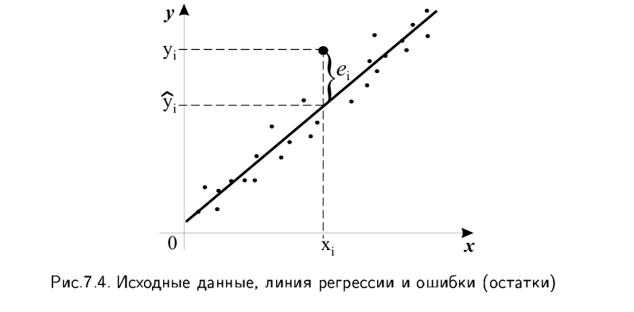

# 17. Парная линейная регрессия. Определение параметров уравнения регрессии методом наименьших квадратов. Теорема Гаусса-Маркова.

## 1. Парная линейная регрессия: Основные понятия

**Регрессионный анализ** — это статистический метод для определения аналитического выражения связи зависимой переменной $y$ (результативный признак) от независимых переменных (факторов).

Если исследуется связь между двумя признаками (одним результативным и одним факторным), регрессия называется **парной**.

### Модель парной линейной регрессии
Рассмотрим двумерную выборку $\{x, y\}$, где:
$$x = \{x_1, x_2, ..., x_n\}$$
$$y = \{y_1, y_2, ..., y_n\}$$

В генеральной совокупности зависимость представляется в виде:
$$y = \beta_0 + \beta_1 x + \varepsilon$$
где:
* $y$ — объясняемая (зависимая) переменная;
* $x$ — объясняющая (независимая) неслучайная переменная;
* $\beta_0, \beta_1$ — параметры уравнения (коэффициенты), которые необходимо оценить;
* $\varepsilon$ — случайная ошибка (возмущение).

На основе выборочных данных строится **выборочное уравнение регрессии**:
$$\hat{y} = b_0 + b_1 x$$
где $b_0, b_1$ — оценки параметров $\beta_0, \beta_1$, а $\hat{y}$ — расчетное значение переменной $y$.

## 2. Определение параметров методом наименьших квадратов (МНК)

Задача заключается в поиске таких коэффициентов $b_0$ и $b_1$, которые обеспечивают наилучшую аппроксимацию исходных данных.
Определим **остаток** $e_i$ как разность между фактическим ($y_i$) и расчетным ($\hat{y}_i$) значением:
$$e_i = y_i - \hat{y}_i = y_i - (b_0 + b_1 x_i)$$

### Суть метода и функция минимизации
Метод наименьших квадратов заключается в минимизации суммы квадратов остатков $Q$:
$$Q = \sum e_i^2 = \sum (y_i - b_0 - b_1 x_i)^2 \rightarrow \min$$

### Необходимые условия экстремума (первые производные)
Для нахождения минимума функции $Q(b_0, b_1)$ необходимо приравнять к нулю её частные производные по неизвестным параметрам $b_0$ и $b_1$:

1.  Производная по $b_0$:
    $$\frac{\partial Q}{\partial b_0} = -2 \sum (y_i - b_0 - b_1 x_i) = 0$$
2.  Производная по $b_1$:
    $$\frac{\partial Q}{\partial b_1} = -2 \sum (y_i - b_0 - b_1 x_i)x_i = 0$$

После преобразований (раскрытия скобок и разделения сумм) получаем **систему нормальных уравнений**:
$$\begin{cases} b_0 n + b_1 \sum x_i = \sum y_i \\ b_0 \sum x_i + b_1 \sum x_i^2 = \sum x_i y_i \end{cases}$$

Разделив на объем выборки $n$, систему можно переписать через средние величины (где $\overline{x} = \frac{1}{n}\sum x_i$ и т.д.):
$$\begin{cases} b_0 + b_1 \overline{x} = \overline{y} \\ b_0 \overline{x} + b_1 \overline{x^2} = \overline{xy} \end{cases}$$

Решая эту систему, получаем итоговые формулы для коэффициентов:
$$b_1 = \frac{\overline{xy} - \overline{x}\cdot\overline{y}}{\overline{x^2} - (\overline{x})^2} = \frac{cov(x, y)}{D(x)}$$
$$b_0 = \overline{y} - b_1 \overline{x}$$

### Достаточные условия минимума (вторые производные)
Чтобы убедиться, что найденная точка является минимумом, нужно проверить вторые частные производные.
Введем обозначения:
$$A = \frac{\partial^2 Q}{\partial b_0^2}, \quad B = \frac{\partial^2 Q}{\partial b_0 \partial b_1}, \quad C = \frac{\partial^2 Q}{\partial b_1^2}$$

Вычислим их, дифференцируя выражения первых производных:
1.  $A = \frac{\partial}{\partial b_0} [-2 \sum (y_i - b_0 - b_1 x_i)] = -2 \sum (-1) = 2n$.
2.  $B = \frac{\partial}{\partial b_1} [-2 \sum (y_i - b_0 - b_1 x_i)] = -2 \sum (-x_i) = 2 \sum x_i$.
3.  $C = \frac{\partial}{\partial b_1} [-2 \sum (y_i - b_0 - b_1 x_i)x_i] = -2 \sum (-x_i)x_i = 2 \sum x_i^2$.

Условием минимума функции двух переменных является положительность определителя матрицы Гессе ($\Delta > 0$) и положительность элемента $A > 0$:
$$\Delta = \begin{vmatrix} A & B \\ B & C \end{vmatrix} = \begin{vmatrix} 2n & 2\sum x_i \\ 2\sum x_i & 2\sum x_i^2 \end{vmatrix}$$

Вынесем общий множитель $2n$ (с учетом преобразования к средним):
$$\Delta = 2n \begin{vmatrix} 1 & \overline{x} \\ \overline{x} & \overline{x^2} \end{vmatrix} = 2n (\overline{x^2} - (\overline{x})^2) = 2n \hat{D}(x)$$

Так как дисперсия $D(x) > 0$ и $A = 2n > 0$, то условия минимума выполнены.

## 3. Теорема Гаусса-Маркова

Теорема формулирует условия, при которых оценки МНК являются наилучшими.

**Условия (предположения) теоремы:**
1.  Модель линейна: $Y = X\beta + \varepsilon$.
2.  Матрица $X$ детерминирована (неслучайна) и имеет максимальный ранг.
3.  Свойства случайной ошибки $\varepsilon$:
    * $M(\varepsilon) = 0$ (математическое ожидание равно нулю).
    * $D(\varepsilon) = \sigma_{\varepsilon}^2 I_n$ (дисперсия постоянна — гомоскедастичность, и ошибки некоррелированы).

**Формулировка теоремы:**
При выполнении указанных условий оценка метода наименьших квадратов $b = (X^T X)^{-1} X^T Y$ является **наиболее эффективной** (имеет наименьшую дисперсию) в классе всех линейных несмещенных оценок.
