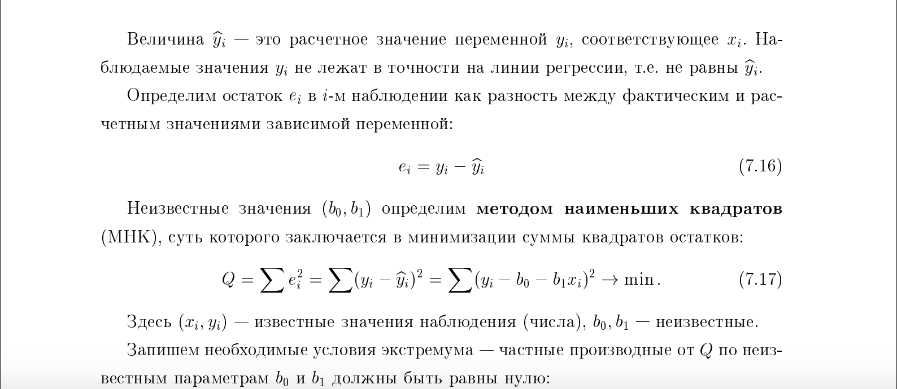
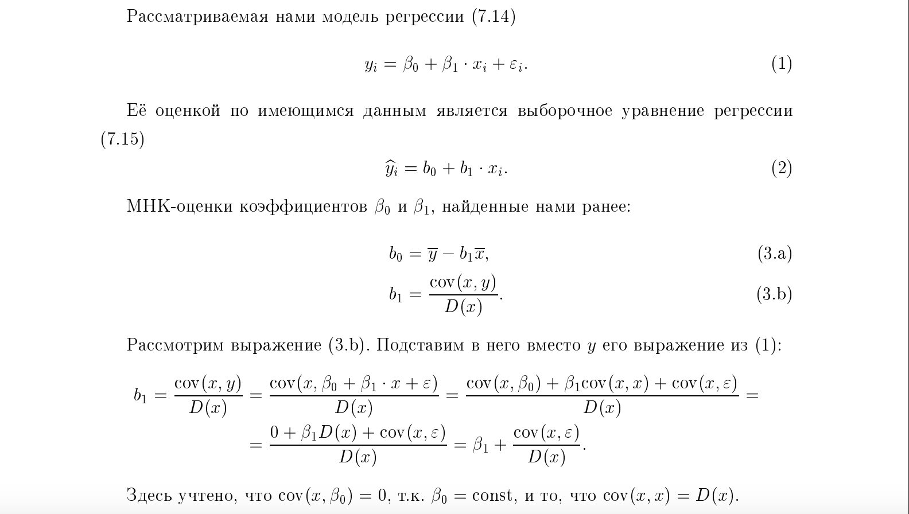
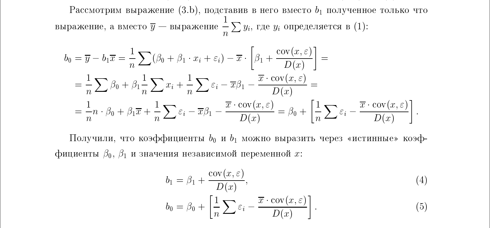
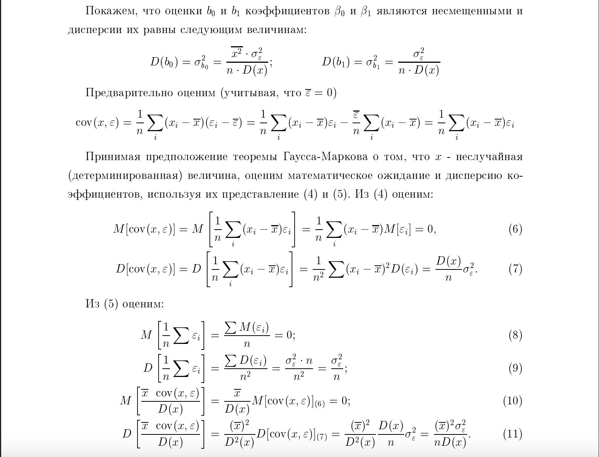
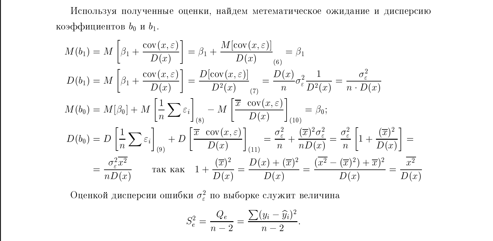
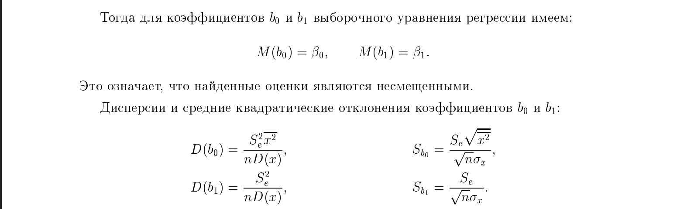

# 19. Свойства коэффициентов уравнения парной линейной регрессии.

### Модель парной линейной регрессии имеет вид:

$$
y_i = \beta_0 + \beta_1 x_i + \varepsilon_i
$$
Индексы $i$ показывают, что модель записана для **каждого наблюдения** в выборке.

где:
- $ y_i $ — **зависимая переменная** (отклик) для $i$-го наблюдения,
- $ x_i $ — **независимая переменная** (фактор, предиктор) для $i$-го наблюдения,
- $ \varepsilon_i $ — **случайная ошибка** для $i$-го наблюдения.
- $ \beta_0 $ — **свободный член** (константа, intercept),
- $ \beta_1 $ — **коэффициент наклона** (slope),

### **Смысл коэффициентов**:

- $ \beta_0 $ (**intercept**) — это **ожидаемое значение** $y$, когда $x = 0$ (если такое значение имеет смысл в контексте задачи).
- $ \beta_1 $ (**slope**) — показывает, **насколько в среднем изменяется** $y$ при увеличении $x$ на одну единицу.

Так как мы оцениваем $\beta_0 = b_0 $ и $\beta_1 = b_1$ стоит пояснить что за коэффициенты $b_0$ и $b_1$:

**Пример**:  
Если $y$ — зарплата (в тыс. руб.), $x$ — стаж (в годах), и  
$$
y = 30 + 5x + \varepsilon,
$$
то:
- $ \beta_0 = 30 $ — ожидаемая зарплата при нулевом стаже,
- $ \beta_1 = 5 $ — при увеличении стажа на 1 год зарплата в среднем растёт на 5 тыс. руб.
 

### Свойства коэффициентов уравнения парной линейной регрессии

### Несмещённость и дисперсии оценок

### Статистические свойства (Что мы рассмотрели выше)
При использовании метода наименьших квадратов (МНК) для оценки коэффициентов, они обладают набором оптимальных свойств,:
*   **Несмещенность**: Математическое ожидание оценок $b_0$ и $b_1$ совпадает с истинными значениями параметров в генеральной совокупности, что гарантирует **отсутствие систематической ошибки** при оценивании.
*   **Эффективность**: Оценки МНК имеют **минимально возможную дисперсию** (разброс) среди всех линейных несмещенных оценок, что делает их наиболее надежными.
*   **Состоятельность**: С увеличением объема выборки значения коэффициентов стремятся (по вероятности) к своим теоретическим значениям.

**Важное замечание**: Эти свойства выполняются только при соблюдении предпосылок регрессионного анализа, таких как **гомоскедастичность** (равенство дисперсий ошибок) и отсутствие их автокорреляции.