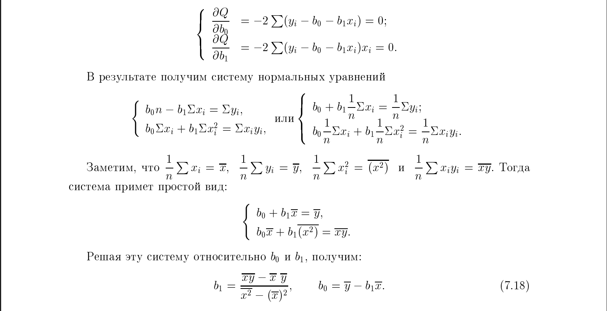
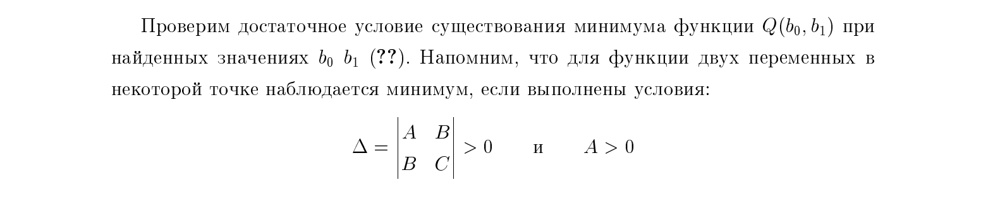
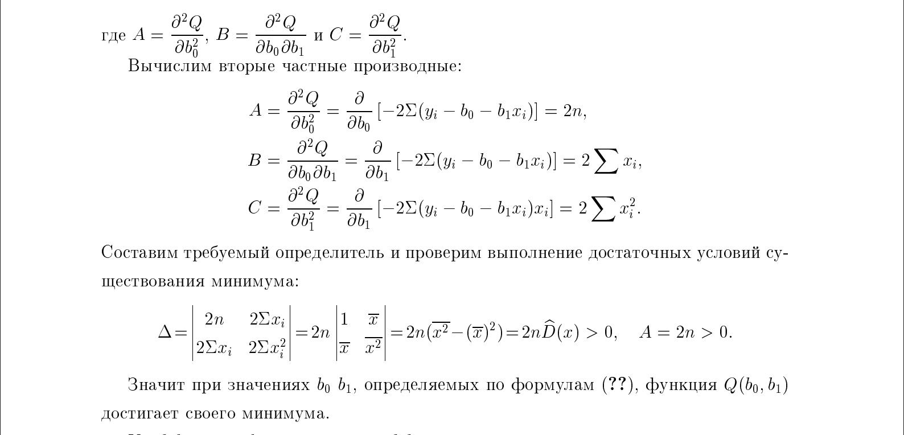

# 19. Свойства коэффициентов уравнения парной линейной регрессии.

### Модель парной линейной регрессии имеет вид:

$
y = \beta_0 + \beta_1 x + \varepsilon
$

где:
- $ y $ — зависимая переменная,
- $ x $ — независимая переменная,
- $ \beta_0, \beta_1 $ — неизвестные параметры (коэффициенты),
- $ \varepsilon$ — случайная ошибка

### Метод наименьших квадратов (МНК)
$
y = \beta_0 + \beta_1 x + \varepsilon
$
будем аппроксимировать $\hat{y} = b_0 + b_1 x$

### Свойства коэффициентов уравнения парной линейной регрессии

### Несмещённость и дисперсии оценок

