# 2. Статистическое оценивание параметров. Методы нахождения точечных оценок параметров: метод моментов К. Пирсона, Метод максимального правдоподобия Р. Фишера, метод наименьших квадратов.

## Опр
**Точечная статистистическая оцена $\hat{\theta}$** - приближенное значение этого параметра, полученное по выборке, т.е $\theta \approx \hat{\theta}$ 

* точечная - значит что оценка это либо число, либо точка на числовой прямой
* Статистическая - значит, что оценка получается по собранной исследователем статистике

Точечная оценка вычисляется следующим способом

$$\hat{\theta} = f(x_1,x_2, ... x_n)$$

где:
* $\hat{\theta}$ - сама оценка
* $x_1, x_2 ... x_n$ - наблюдения
* f(x) - представляет собой алгоритм вычисления оценки

**Найти ошибку приближения не получится, т.к в большинстве случаев мы не знаем истинное значение**

Но если считать, что $x_1, x_2, ... x_n$ это просто какие-то значения случайной велечины X, то $\hat{\theta}$ это функция от случайной велечины, т.е тоже случайная велечина. А для них можно считать Мат.Ожидание и Дисперсию, а также закон распеределения

Если рассматривать $\hat{\theta}$ как С.В, то можно предъявить свойства, обладая которыми, можно говорить, что приблежение хорошего качества. Эти свойства

* Cостоятельность
* Несмещенность
* Эффективность

## Опр

**Состоятельная оценка $\hat{\theta}$** - означает, что с ростом n, её предел по вероятность равен оцениваемому параметру

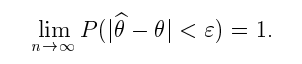

Если короче: Чем больше наблюдений, тем меньше отклонений $\hat{\theta}$ от $\theta$

**Оценка обязательно должна быть состоятельной**

## Опр
**Несмещенная оценка $\hat{\theta}$** - означает, что её Мат.Ожидание равно оцениваемому параметру $\theta$ при любом фиксированном n

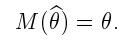

У смещенной оценки это будет не так, т.к она обладает смещением равным $M(\hat{\theta}) - \theta$

Если наглядно
* первая оценка - несмещенная
* вторая смещена

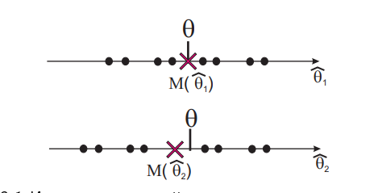

**Несмещенность гарантирует отсутствие систематических ошибок при оценивании**

## ОПР

**Эффективная оценка $\hat{\theta}$** - имеет минимальную дисперсию среди других выборочных оценок

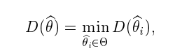

Если наглядно
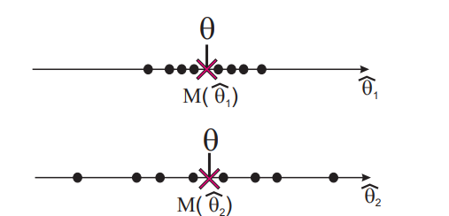

### Неравенство Рао Крамера Фреше
Вставлю тут фотку, т.к не помню, чтобы мы его использовали при решении задач. Блестните знаниями, если захотите :)

Вообще эта штуковина нужна для того, чтобы находить минимум из дисперсий оценок. Зная минимум можно сравнить его с дисперсией получившейся оценки и понять на сколько она хорошая

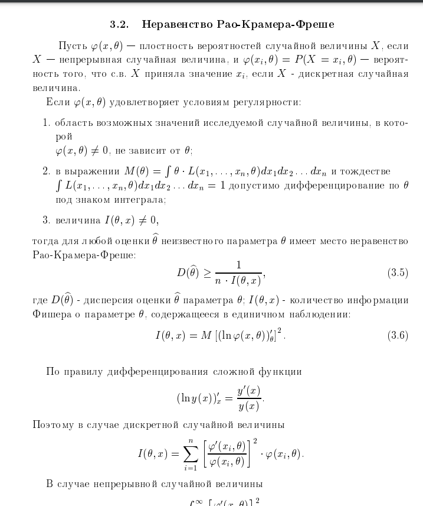
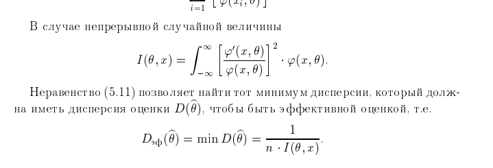

## Cвойства основных выборочных оценок

### Частость
* Частость - точечная оценка вероятности события 
  * Выборочная доля - точечная оценка генеральной доли

N - объем выборки генеральной совокупности.
M - кол-во эл-тов выборки генеральной совокупности с нужным свойством A
p = $\frac{M}{N}$ - генеральная доля или вероятность события A
w = $\frac{m}{n}$ - выборочная доля,где
  * m - кол-во эл-тов взятых из выборки генеральной совокупности с нужным св-ом A, т.е m < M
  * n - кол-во каких эл-тов взятых из исходной генеральной совокупности. n < N

**Рассмотрим повторную выборку**

Т.к выборка повторная, то вероятность извлечь элемент не зависит от ранее извлеченных эл-тов, т.е **события являются независимыми**

число m - можно представить как сумму n св $X_i$, где:
* $X_i$ = 1,если $X_i$ - обладает свойством A
* $X_i$ = 0,если $X_i$ - не обладает свойством A

i - это номер наблюдения

Таким образом получаем, что X_i - распределена по Закону Бернулли, а значит:
* $M(X_i)=n \cdot p$
* $D(X_i)=n\cdot p \cdot (1-p)$

Дальше приводится д-во, что выборочная доля это эффективная, состоятельная и несмещенная оценка

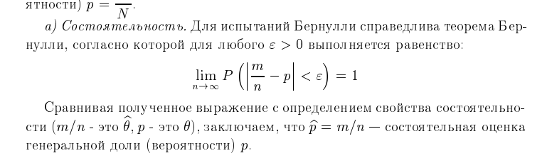
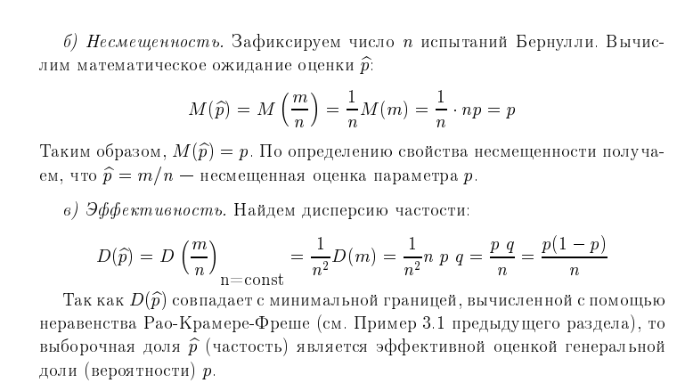

Теперь рассмотрим **Бесповторную выборку**

Теперь св $X_i$ - будут зависимыми

X_i оказываются подчинены гипергеометрическому закону распределения, следовательно:
* $$M(X_i) = n \cdot \frac{M}{N}$$
* $$D(X_i) = n \cdot \frac{\frac{M}{N} \cdot (1 - \frac{M}{N}) \cdot (N - n)}{N-1}$$

**это состоятельная, несмещенная оценка генеральной доли**

### Выборочное среднее $\bar{X} = \frac{1}{n}\cdot\sum X_i$

* Среднее по выборке - это точечная оценка Мат.Ожидания

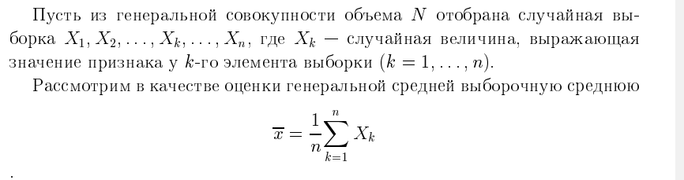

**При повторной выборке**

$X_i$ - снова независимые

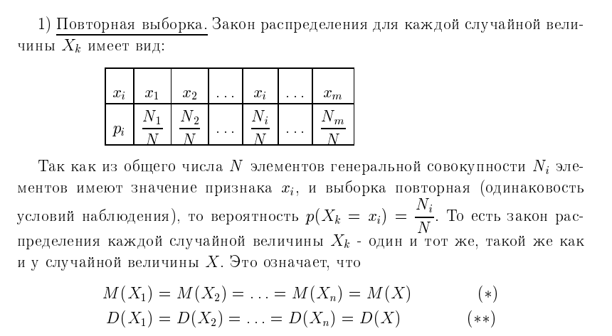

далее д-во, что среднее по выборке это состоятельная, несмещенная оценка генеральной средней с дисперсией $\sigma_{\bar{x}}^2 = \frac{\sigma^2}{n}$

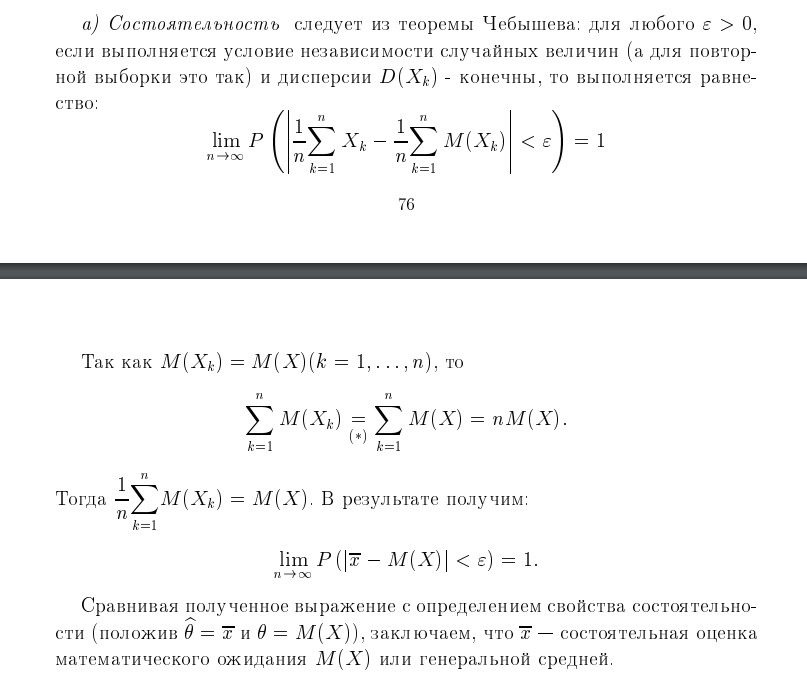

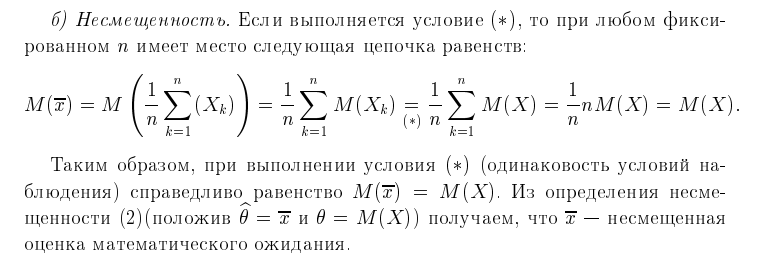

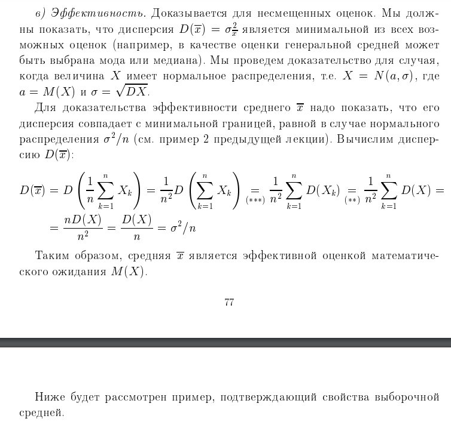

**Повторная выборка**

$X_i$ - зависимые СВ

Является состоятельной и несмещенной оценкой генеральной средней

### Выборочная дисперсия $D(X_i) = \frac{1}{n} \cdot \sum(X_i - \bar{X})^2$

* является оценкой для дисперсии
* состоятельная и смещенная оценка генеральной дисперсии
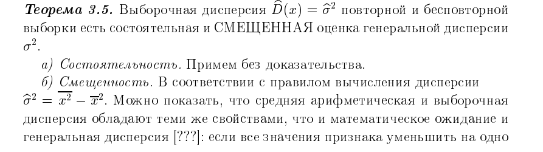
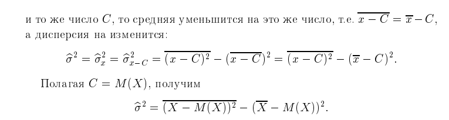

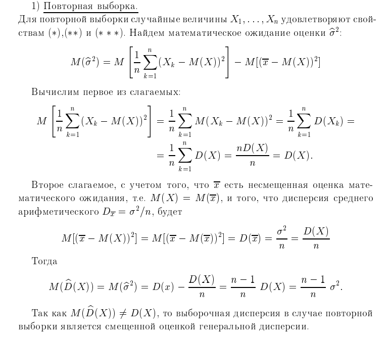
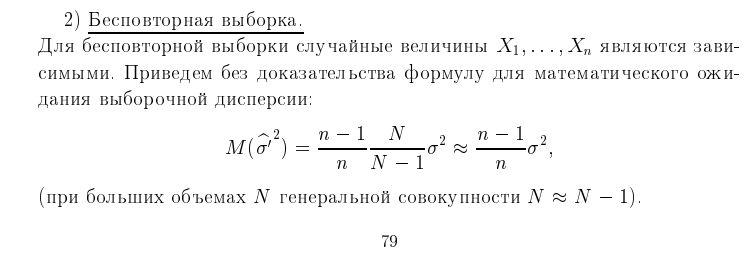

### Исправленная выборочная дисперсия $s^2 = \frac{n}{n-1} \cdot \sum (X_i - \bar{X})^2$
* имеет связь с обычной дисперсией $s^2 = \sigma^2 * \frac{n}{n-1}$

**Повторная выборка**

является состоятельной, несмещенной оценкой генеральной дисперсии

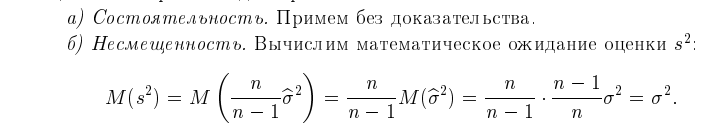

**Бесповторная выборка**

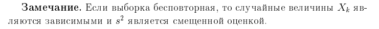

## Методы нахождения точечных оценок

### Метод моментов

Метод моментов состоит в том, что начальные и центральные **выборочные** моменты приравниваются к **теоретическим** моментам. Из решения уравнения находятся неизвестные параметры

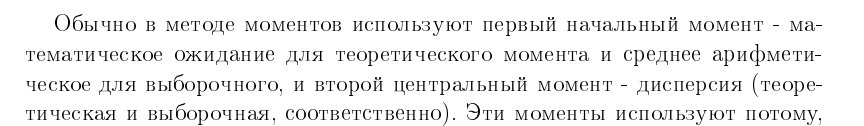

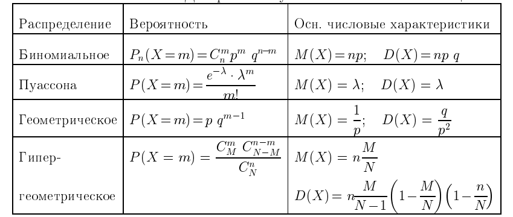
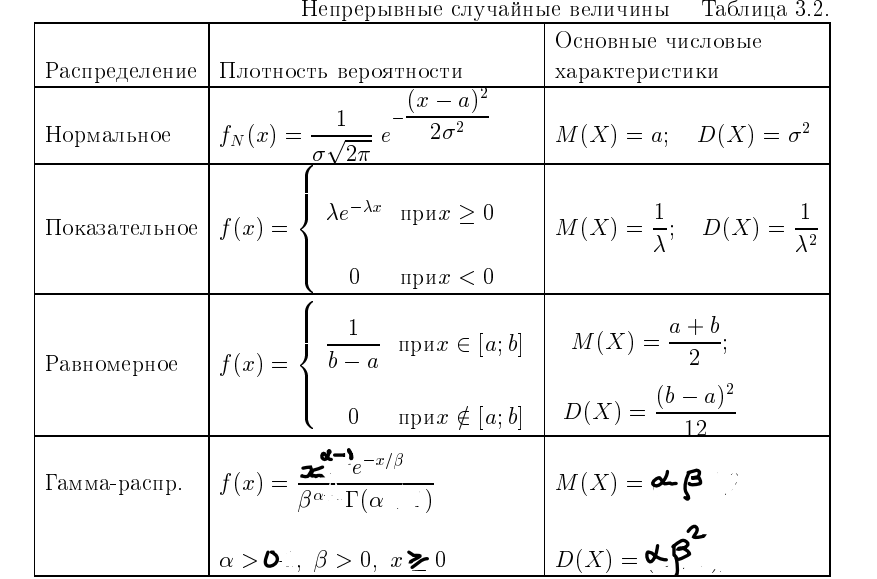

### Метод максимального правдоподобия(ММП) Фишера

Пусть есть выборка $X = (x_1, x_2, ... x_n)$, полученная из генеральной совокупности по закону $f(x, \theta)$

если x_i - Д.С.В, то $f(x_i, \theta)$ - вероятность $p_i$, если Н.С.В, то плотность

Понятно, что взависимости от выборки X, распределение $f(x, \theta)$ будет отличаться

Требуется найти такой параметр $\theta$, чтобы вероянтость $f(x, \theta)$ лучше описывала выборку X, т.е была бы максимальной

для этого вводят специальную функцию:

$$L(x, \theta) = f(x_1,\theta) \cdot f(x_2,\theta) \cdot ... f(x_n,\theta)$$

* L - это функция правдопободия
* она работает только если X - независимые случайные велечины

Дальше ищут такое $\theta$, чтобы достигался максимум этой функции

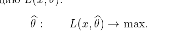

ищут его с помощью производной, но т.к считать производную произведения(особенно, когда там много множителей) это не для белых людей, то белые люди решили схитрить и считать производную такой функции $$l = ln(L(x, \theta)) = ln(f(x_1,\theta)) + ln(f(x_2,\theta)) + ... ln(f(x_n,\theta))$$

По свойству получаем, что мы уже считаем производную суммы логорифмов, что значительно проще

ну и всё - теперь находим критические точки и проверяем их на экстремум(выбираем максимальную)

гайдик как находить точку максимума при 2 параметрах
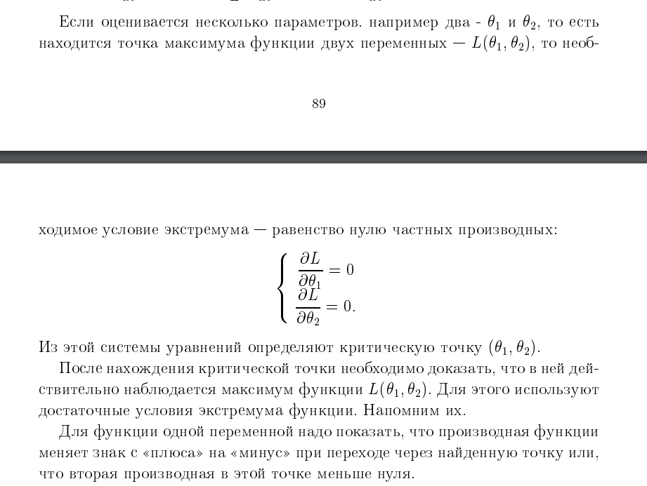
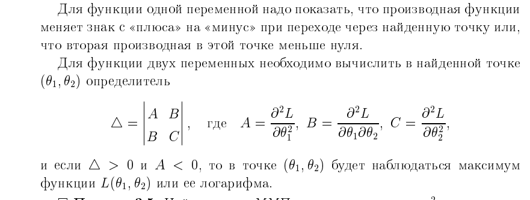

### Метод наименьших квадратов (МНК)

Здесь оценка определяется из поиска минимума следующей функции

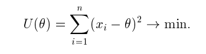

