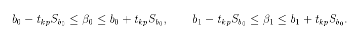

# 20. Проверка гипотез о значимости коэффициентов уравнения регрессии. Интервальные оценки истинных коэффициентов уравнения линейной регрессии.

Проверка гиппотезы о значимости коэфов нужна для определения качества модели, т.к возможны ситуации, когда некоторые коэфы регрессии не значимы, т.е их значения меньше чем их стандартные ошибки

Поэтому для каждого коэфициента проверяют гиппотезу:
$$H_0: b_i = 0$$
$$H_1: b_i \neq 0$$

В качестве статистик используются

$$t_{b_0} = \frac{b_0}{s_{b_0}}$$

$$t_{b_1} = \frac{b_1}{s_{b_1}}$$

Где $s_{b_0}$ и $s_{b_1}$ - Стандартные ошибки параметров коэфов, которые считаются по формулам

$$S_{b_1} = \frac{S_e}{s_x\sqrt{n}}$$

$$S_{b_1} = S_e \frac{\sqrt{\sum x^2}}{n s_x}$$

$$S_e = \frac{Q_e}{n-2}$$

Величина t - имеет распределение стьюдента с $k=n-p-1$ числом степеней свободы

$t_{кр} = T(\alpha, k)$

* Если $|t_{b_i}|>|t_{кр}|$, то коэфициент значим H_0 отвергаем
* Если $|t_{b_i}|<|t_{кр}|$, то коэфициент незначим H_0 принимаем

Также $t_{кр}$ позволяет найти интервальную оценку с надежностью $\alpha$
