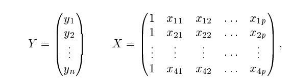
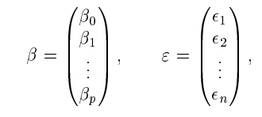
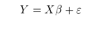

# 26. Прогнозирование в модели множественной линейной регрессии.

## Модель множественной регрессии

Это уравнение зависимости между результатом и несколькими факторами:
$$y = f(x_1, x_2, ... , x_n, e)$$

где:
* y - зависимая переменная(результат)
* $x_1, x_2, ... , x_n$ - независимые переменные(факторы)
* e - случайная компонента
* f - это математическая функция
  * Можно брать линейную, степенную, квадратическую т.е вообще любую, главное, чтобы она как-то описывала зависимость

Чтобы выбрать эту f нужно **специфицировать модель**, т.е:
* Отобрать нужные факторы
  * они должны быть независимыми друг от друга(в идеале), либо должны оч слабо коррелировать
  * должны быть коррелированы с зависимой переменной
  * Должны быть сильно вариабельными, т.е должны сильно откланяться от их среднего значения
    * Если по человечески: есть много значений которые может принимать фактор
* Выбрать вид уравнения регрессии

Переменные отбираются следующими способами:
* Исключают квазипеременные, т.е переменные, которые не меняются от наблюдения к наблюдению
* с помощью анализа парных и частных коэфициентов корреляции(можно определить сильно коррелированные факторы и выбрать из них только один)
* По R - коэфициент множественной корреляции или по $R^2$ - коэфициент детерминации
  * прикол в том, что $R^2$ показывает какая доля дисперсии $y$ зависит от влияния фактора, т.е если мы будем добавлять коэфициент и видить сильный/слабый рост $R^2$, то можем делать вывод о том, оставлять или убирать этот коэф
* Исключенение качественных переменных, т.к у них слабая вариабельность
* [Метод информационной емкости](https://studfile.net/preview/7456555/page:7/)

## Про линейную модель множественной регрессии

### ОПР(Линейная модель регрессии)

$$Y = \beta_0 + \sum_{i=1}^{p} \beta_i X_i + \varepsilon$$

Где:
* Y - объясняемая переменная(результат)
* $X_i$ - объясняющие переменные(факторы)
* $\beta_i$ - коэфициенты модели
* $\varepsilon$ - ошибка модели
* n - кол-во наблюдений
* p - кол-во факторов

обычно эту модель записывают в векторноматричном виде

столбик из единиц, нужен для отображения коэфициента свободного члена модели

### Добавка от ии

### 1. Суть концепции: От объяснения к предсказанию

**Множественная регрессия** — это статистическая модель, которая устанавливает количественную связь между одной **зависимой переменной (откликом, Y)** и несколькими **независимыми переменными (предикторами, регрессорами, X₁, X₂, ..., Xₚ)**.

**Прогнозирование** — это применение построенной и проверенной модели для оценки *вероятного значения* зависимой переменной **Ŷ** при новых, ранее не наблюдавшихся значениях предикторов.

**Физическая аналогия:** Представьте, что вы вывели закон движения для тележки на наклонной плоскости: `S = a * t² / 2 + V₀ * t + S₀`. Здесь `S` — путь (Y), `a`, `V₀`, `S₀` — параметры (коэффициенты модели), а `t` — время (X). После того как вы экспериментально определили параметры (a, V₀, S₀) в лаборатории, вы можете использовать эту формулу для *прогноза* пути тележки через 10 секунд, не ставя каждый раз эксперимент.

### 2. Математическая основа прогноза

Модель множественной линейной регрессии имеет вид:

**Y = β₀ + β₁X₁ + β₂X₂ + ... + βₚXₚ + ε**

Где:
*   **Y** — прогнозируемая переменная.
*   **Xⱼ** — предикторы.
*   **β₀** — интерцепт (свободный член).
*   **βⱼ** — коэффициенты регрессии, которые оцениваются по обучающим данным (обычно методом наименьших квадратов — МНК).
*   **ε** — случайная ошибка (шум), которую мы не можем предсказать.

После оценки коэффициентов **(b₀, b₁, ..., bₚ)** мы получаем **прогнозное уравнение**:

**Ŷ = b₀ + b₁X₁ + b₂X₂ + ... + bₚXₚ**

**Ŷ** — это **точечный прогноз**, точечная оценка *среднего ожидаемого значения* Y для заданного набора X.

### 3. Типы прогнозов и интервалы предсказания (Ключевой момент!)

Физик понимает, что любое измерение и модель имеют погрешность. В регрессии это выражается через **интервалы предсказания**.

1.  **Прогноз для среднего значения (Mean Prediction):** Мы прогнозируем *средний* отклик для всех объектов с заданными X. Его доверительный интервал **уже**.
2.  **Прогноз для индивидуального значения (Individual Prediction):** Мы прогнозируем значение Y для *конкретного нового* объекта с заданными X. Его интервал предсказания **шире**, так как включает дополнительную неопределенность, связанную со случайной ошибкой ε для этого конкретного объекта.

**Формула для интервала предсказания (индивидуального) в упрощенном виде** зависит от:
*   Стандартной ошибки модели (s).
*   Количества наблюдений (n).
*   "Расстояния" новых X от средних значений обучающей выборки (выражается через **матрицу "шляп"** — Hat matrix). Чем дальше новые данные от центра обучающего множества (**экстраполяция**), тем шире интервал и тем ненадежнее прогноз.

**Физическая аналогия:** Ваш закон для тележки был выведен для углов наклона от 10° до 40° и времени до 5 секунд.
*   **Интерполяция** (прогноз для t=3с, угол 25°) — надежна, интервал узкий.
*   **Экстраполяция** (прогноз для t=20с или угол 60°) — крайне ненадежна! Модель может не учитывать трение (которое станет значимым при больших t) или другие силы. Интервал предсказания станет огромным, что является статистическим красным флагом.

### 4. Поэтапный процесс прогнозирования

1.  **Построение и валидация модели (Экспериментальная фаза):**
    *   Сбор репрезентативных данных.
    *   Проверка предпосылок регрессии: линейность, нормальность остатков, гомоскедастичность, отсутствие сильной мультиколлинеарности.
    *   Оценка коэффициентов.
    *   Проверка качества модели: R² (скорректированный), F-статистика, анализ остатков.

2.  **Получение новых данных для прогноза:** Появление нового наблюдения или набора наблюдений с известными значениями предикторов `X_new`, для которых Y неизвестен и его нужно спрогнозировать.

3.  **Применение прогнозного уравнения:** Подстановка `X_new` в уравнение `Ŷ = b₀ + b₁X₁ + ... + bₚXₚ`.

4.  **Оценка неопределенности:** Расчет **интервала предсказания** (обычно 95%), который дает диапазон, в котором с заданной вероятностью будет находиться истинное значение Y.

### 5. Особенности и предостережения (Взгляд физика)

*   **Корреляция ≠ Причинность:** Модель может отлично прогнозировать, но не объяснять физику процесса. Пример: количество проданного мороженого и число утоплений коррелируют, но причиной является третий фактор — жаркая погода.
*   **Экстраполяция опасна:** Физические системы часто нелинейны за пределами изученной области. Прогноз за пределами диапазона данных — это гадание.
*   **Учет всех значимых факторов:** Как в физическом эксперименте, если вы не учли важную силу (предиктор), ваша модель будет давать смещенные прогнозы. Например, прогнозируя расход топлива автомобиля только по его скорости, вы упустите влияние стиля вождения и сопротивления воздуха.
*   **Интерпретируемость vs. Точность:** Часто в физике важнее понять вклад каждого фактора (значимость βⱼ), чем просто получить точный "черный ящик" для прогноза (как в некоторых сложных ML-моделях).
*   **Проверка остатков:** Если остатки (разница между предсказанным и реальным Y в обучающей выборке) содержат какую-либо закономерность (тренд, гетероскедастичность) — модель неполна, и прогнозы будут субоптимальными.
