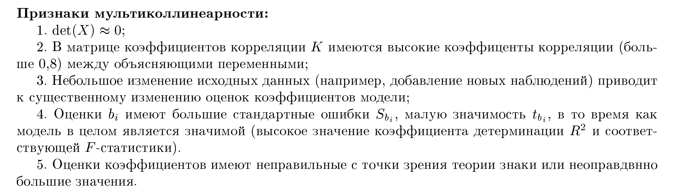

# 27. Мультиколлинеарность, ее влияние на свойства оценок параметров линейной множественной регрессии. Способы обнаружения мультиколлинеарности. Методы решения задач с мультиколлинеарными факторами.

### 1. Понятие мультиколлинеарности
**Мультиколлинеарность** — это наличие сильной линейной зависимости (высокой корреляции) между объясняющими переменными (факторами) $x_1, x_2, \dots, x_k$ в модели множественной регрессии.

Выделяют **два вида мультиколлинеарности**:

*   **Функциональная (совершенная):** возникает, когда между факторами существует строгая линейная функциональная зависимость. В этом случае определитель матрицы $(X^T X)$ равен нулю ($\det(X^T X) = 0$), матрица становится вырожденной, и классический метод наименьших квадратов (МНК) применить невозможно, так как нельзя вычислить обратную матрицу.

*   **Случайная (стохастическая):** возникает, когда между факторами существует сильная статистическая связь (высокая корреляция), но не строгая функциональная зависимость. В этом случае определитель матрицы $(X^T X)$ близок к нулю, что порождает ряд проблем при оценке параметров.

---

### 2. Влияние на свойства оценок параметров
Наличие мультиколлинеарности не нарушает несмещенность оценок, но крайне негативно влияет на другие свойства:

1.  **Сохранение несмещенности:** Оценки параметров, полученные по МНК, остаются несмещенными.
2.  **Огромные дисперсии оценок:** Главное негативное влияние заключается в резком увеличении дисперсий и стандартных ошибок оценок коэффициентов регрессии. Формула дисперсии оценки $j$-го параметра имеет вид:
    $$\sigma^2(b_j) = \frac{\sigma^2}{\sum (x_j - \bar{x}_j)^2} \cdot \frac{1}{1 - R_j^2}$$
    где $R_j^2$ — коэффициент детерминации регрессии переменной $x_j$ по остальным факторам. При $R_j^2 \to 1$ величина $1/(1-R_j^2)$ (VIF) стремится к бесконечности, что делает оценки крайне нестабильными.
3.  **Ненадежность интерпретации:** Становится невозможным выделить индивидуальное влияние каждого отдельного фактора на результативный признак $y$, так как факторы «переплетены» между собой.
4.  **Статистическая незначимость:** Из-за больших стандартных ошибок расчетные значения $t$-критериев Стьюдента получаются маленькими. Это приводит к тому, что коэффициенты регрессии признаются статистически незначимыми, хотя модель в целом может иметь высокий коэффициент детерминации $R^2$ и быть значимой по критерию Фишера.
5.  **Неустойчивость оценок:** Незначительное изменение исходных данных (добавление или удаление нескольких наблюдений) может привести к существенному изменению величин и даже знаков коэффициентов регрессии.

---

### 3. Способы обнаружения мультиколлинеарности
Для выявления проблемы используются следующие индикаторы:

*   **Анализ матрицы парных коэффициентов корреляции факторов:** Если в матрице коэффициентов корреляции $K$, какой-то коэффициент между двумя факторами по модулю превышает 0,8 ($|r_{x_i x_j}| > 0,8$), это явный признак высокой мультиколлинеарности.
*   **Анализ определителя матрицы корреляции $\det(R)$:** Если определитель матрицы корреляции между факторами близок к нулю, это свидетельствует о наличии общей мультиколлинеарности в системе факторов.
* **Неустойчивость МНК-оценок:** Незначительное изменение исходных статистических данных (например, добавление новых наблюдений или удаление одного объекта из выборки) приводит к существенному изменению значений коэффициентов модели.
* **Противоречие между теоретическими ожиданиями и расчетами:** Оценки коэффициентов $b_i$ имеют «неправильные» с точки зрения теории знаки (например, цена товара положительно влияет на спрос) или неоправданно большие значения.
* **Противоречие критериев значимости ($F$ и $t$):** Это один из наиболее надежных признаков. Ситуация, когда модель в целом является качественной и значимой (высокое значение коэффициента детерминации $R^2$ и соответствующей $F$-статистики), но при этом оценки отдельных параметров $b_i$ имеют большие стандартные ошибки $S_{b_i}$ и, как следствие, низкую значимость по $t$-критерию.
---

### 4. Методы решения задач с мультиколлинеарностью
Если мультиколлинеарность обнаружена и мешает качественному прогнозированию или анализу, применяются следующие шаги:

1. **Исключение переменной:** Это наиболее простой способ, заключающийся в удалении одного из двух сильно коррелирующих факторов (больше $0.8$)

* **Суть:** Обычно исключают тот фактор, который имеет меньшую логическую связь с зависимой переменной $y$ или меньший коэффициент парной корреляции с ней.
* **Риски:** Если исключенная переменная была теоретически значима для модели, это может привести к **смещению оценок** оставшихся параметров. Также существует риск столкнуться с «ложной корреляцией», которая не отражает реальной зависимости явлений.

2. **Увеличение объема выборки**: Мультиколлинеарность приводит к резкому росту дисперсии оценок МНК.

* **Математическое обоснование:** Дисперсия оценки $j$-го параметра определяется формулой:
    $$\sigma^2(b_j) = \frac{\sigma^2}{\sum (x_{ij} - \bar{x}_j)^2} \cdot \frac{1}{1 - R_j^2}$$

    Вспомним формулу выборочной дисперсии:$$\sigma_{x_j}^2 = \frac{\sum_{i=1}^{n} (x_{ij} - \bar{x}_j)^2}{n}$$
    Отсюда следует, что сумма квадратов отклонений равна:$$\sum (x_{ij} - \bar{x}_j)^2 = n \cdot \sigma_{x_j}^2$$
    Если подставить это выражение в вашу исходную формулу дисперсии коэффициента, мы получим:$$\sigma^2(b_j) = \frac{\sigma^2}{n \cdot \sigma_{x_j}^2 \cdot (1 - R_j^2)}$$
* **Увеличение объема выборки $n$** увеличивает знаменатель, что ведет **к снижению стандартной ошибки $SE$** (корень из $\sigma^2(b_j)$) и повышению устойчивости оценок коэффициентов.

3. **Использование метода главных компонент (МГК):** Метод направлен на переход от исходных коррелированных факторов к новым, некоррелированным переменным.

*   **Суть:** Исходные переменные $x_1, x_2, \dots, x_k$ преобразуются в **главные компоненты** $z_1, z_2, \dots, z_k$, которые представляют собой линейные комбинации исходных признаков.
*   **Математическое преимущество:** Поскольку новые компоненты ортогональны (независимы), мультиколлинеарность между ними полностью отсутствует. 
*   **Проблема:** Главная трудность метода заключается в содержательной **интерпретации коэффициентов** при новых переменных $z$, так как они больше не являются прямыми показателями влияния конкретных факторов.

4. **Использование «гребневой» (Ridge) регрессии:** Этот метод применяется, когда матрица $(X^T X)$ близка к вырожденной (определитель $= 0$) из-за сильной связи факторов.

*   **Проблема:** При мультиколлинеарности определитель матрицы $\det(X^T X)$ близок к нулю, что делает невозможным получение надежной обратной матрицы для расчета оценок $b = (X^T X)^{-1} X^T Y$.
*   **Решение:** В методе гребневой регрессии исходная матрица «подправляется» путем добавления к её диагонали малого положительного числа (параметра регуляризации $\lambda$):
    $$\tilde{X}^T \tilde{X} = (X^T X) + \lambda I$$
    где $I$ — единичная матрица.
*   **Результат:** Матрица становится **невырожденной**, что позволяет применить МНК, хотя полученные оценки будут несколько смещенными, но гораздо более устойчивыми.

5. **Использование рекуррентных методов:** Рекуррентные (итерационные) методы позволяют оценивать параметры модели последовательно, по мере поступления новых данных.

*   **Суть:** Эти алгоритмы позволяют находить оценки параметров без прямого **обращения матрицы** $(X^T X)$.
*   **Значение:** Это критически важно в условиях мультиколлинеарности, так как именно операция обращения вырожденной или почти вырожденной матрицы является источником численной неустойчивости и огромных ошибок в расчетах.

**Если игнорировать мультиколлинеарность,** при использовании классического МНК и обращении матрицы \(X^{T}X\) возникнут огромные ошибки, численная неустойчивость, оценки параметров станут ненадежными, доверительные интервалы — широкими, а модель будет плохо обобщаться, несмотря на хорошую подгонку к обучающим данным, из-за чего прогнозирование на новых данных (даже близких к тренировочным) будет непредсказуемо плохим. Рекуррентные методы обходят эту проблему, обновляя оценки без прямого обращения, что критически важно для стабильности. 