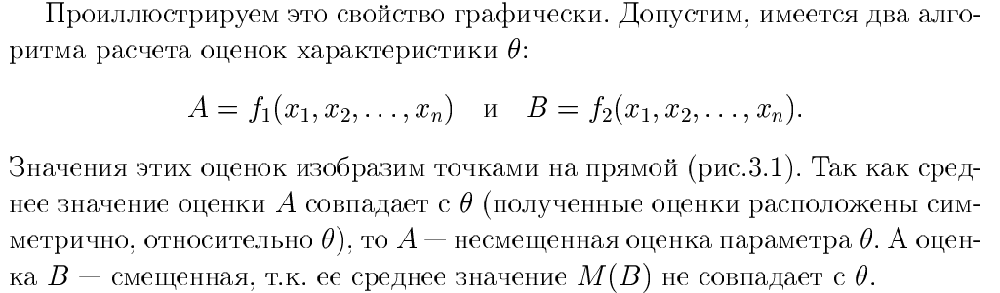
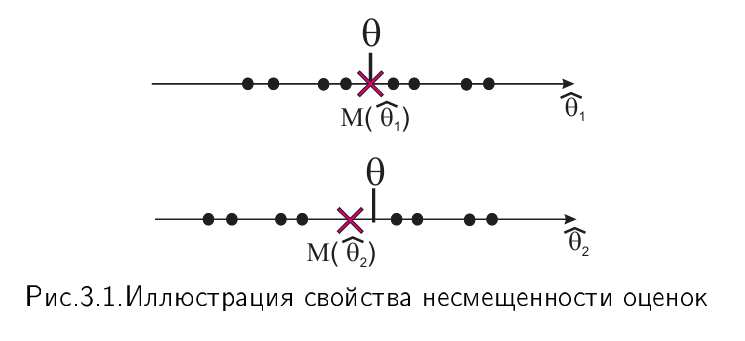
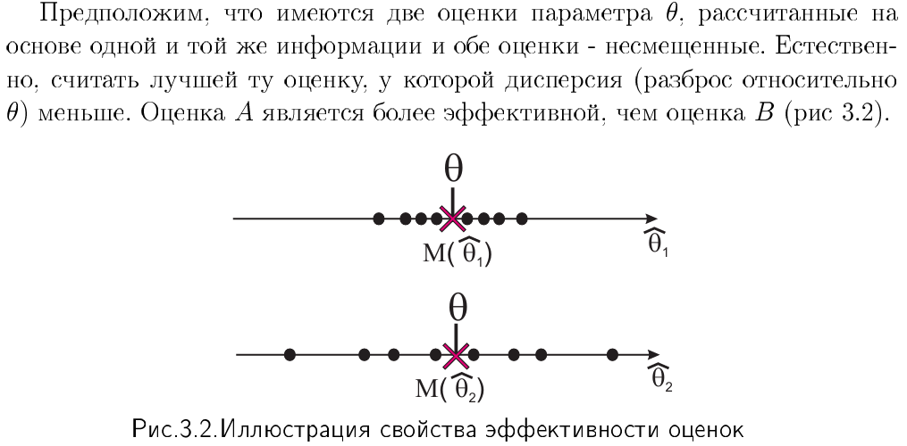
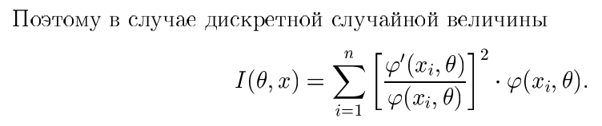
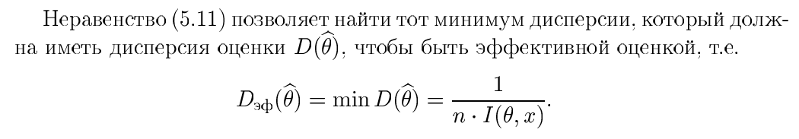

# 3. Точечные оценки и их свойства (несмещенность, эффективность, состоятельность).

**Точечной статистической оценкой** $\hat{\theta}$ параметра $\theta$ называется приближенное значение этого параметра, полученное на основе выборки. Оценка представляет собой число или точку на числовой прямой.

Оценка является функцией от результатов наблюдений:
$$ \hat{\theta} = f(x_1, x_2, \dots, x_n) $$
Так как результаты наблюдений $x_i$ являются случайными величинами, то и сама оценка $\hat{\theta}$ также является **случайной величиной**, обладающей своим математическим ожиданием, дисперсией и законом распределения.

Чтобы оценка считалась «хорошим» приближением к параметру, она должна обладать свойствами **состоятельности, несмещенности и эффективности**.

### 1. Состоятельность

**Определение:** Оценка $\hat{\theta}$ называется **состоятельной**, если при неограниченном увеличении объема выборки ($n \to \infty$) она стремится по вероятности к оцениваемому параметру $\theta$:
$$ \lim_{n \to \infty} P(|\hat{\theta} - \theta| < \epsilon) = 1 $$
где $\epsilon > 0$ — произвольно малое число.

**Смысл:** Это свойство означает, что с ростом объема исходной информации вероятность значительного отклонения оценки от истины стремится к нулю. Если оценка не обладает состоятельностью, увеличение выборки не гарантирует уточнения значения параметра.

### 2. Несмещенность

**Определение:** Оценка $\hat{\theta}$ называется **несмещенной**, если ее математическое ожидание равно оцениваемому параметру $\theta$ при любом фиксированном объеме выборки $n$:
$$ M(\hat{\theta}) = \theta $$

Если это равенство не выполняется, оценка называется **смещенной**, а разность $M(\hat{\theta}) - \theta$ называется **смещением**.

**Смысл:** Требование несмещенности гарантирует отсутствие систематических ошибок при оценивании. Среднее значение всех возможных оценок, вычисленных по разным выборкам одного объема, будет в точности равно истинному параметру.

### 3. Эффективность

**Определение:** Несмещенная оценка $\hat{\theta}$ называется **эффективной**, если она имеет минимальную дисперсию по сравнению с другими возможными несмещенными оценками того же параметра:
$$ D(\hat{\theta}) = \min_{\hat{\theta}_i \in \Omega} D(\hat{\theta}_i) $$
где $\Omega$ — множество всех возможных несмещенных оценок параметра $\theta$.

Для проверки эффективности используется **неравенство Рао — Крамера — Фреше**, которое задает нижнюю границу дисперсии:
$$ D(\hat{\theta}) \geq \frac{1}{n \cdot I(\theta; x)} $$
где $I(\theta; x)$ — **информация Фишера** о параметре $\theta$, содержащаяся в одном наблюдении. Для непрерывной величины она равна:
$$ I(\theta; x) = \int_{-\infty}^{\infty} \left( \frac{\varphi'_\theta(x; \theta)}{\varphi(x; \theta)} \right)^2 \varphi(x; \theta) dx $$

Если дисперсия оценки достигает этой нижней границы, она является эффективной.

---
**Аналогия:**
Представьте стрельбу по мишени.
*   **Несмещенность** — ваш прицел не сбит, и центр кучности попаданий совпадает с «десяткой».
*   **Эффективность** — ваши выстрелы ложатся очень кучно, с минимальным разбросом.
*   **Состоятельность** — чем больше вы тренируетесь (увеличиваете выборку), тем неизбежнее ваши попадания стягиваются в одну точку в самом центре.
