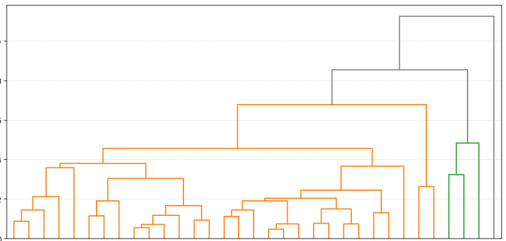
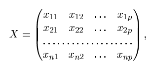

# 32. Иерархические процедуры кластерного анализа. Меры близости между кластерами.

### ОПР (Кластерного анализа)

**Кластерный анализ** - вид многомерной классификации априорной информации о числе и типе классов, на которые разбивается совокупность объектов. Полученные в результате разбиения классы называют кластерами

Кластерный анализ применяют:
* для классификации слабоизученных явлений
* в качестве предварительного этапа обработки данных
* при проверке предположения о наличии некоторой структуры в изучаемой совокупности объектов

Методы кластерного анализа подразделяют на:
* Итеративные (k-means)
* Иерархические (метод ближней связи, метод дальней связи, метод уорда)

### Про иерархические процедуры кластерного анализа

иерархические процедуры разделяют на:
* **алгомеративные** - последовательно объединяющие сначала близкие, а затем более отдаленные друг от друга объекты в группы(кластеры)
* **дивизимные** - разделяющие сначала самые далекие группы, а затем всё более близкие друг к другу на группы на отдельные объекты

* с помощью иерархических процедур можно построить график **дендраграмму**:
* 
* Требуют много вычислений, так что при большом объеме данных можно о них забыть

### Про меры близости

Данные представляются в виде матрицы

где:
* $x_{i,j}$ - значение j-ого ($j \in \{1,2,..., p\}$) анализируемого признака, характеризующего состояние i-ого ($i \in \{1,2,...,n\}$) объекта
* p - число признаков
* n - число наблюдений

Для классификации вводят понятие сходства объектов по их признакам, которое задаётся введением метрики для расчёта расстояний между объектами

**Выбор метрики это важно**

## Вектор это строка

### Обычно в качестве метрик используют:
**Обобщенное расстояние Махаланобиса**(имя у чувака конечно хайповое)
$$d_{i,k}=\sqrt{(x_i - x_k)^T \Lambda ^ T \Sigma^{-1}\Lambda(x_i-x_k)}$$
где
* $\Lambda$ - диагональная матрица весовых коэфициентов исходных показателей
* $\Sigma^{-1}$ - матрица обратная ковариационной матрице $\Sigma$
* x_i - вектор $(x_{i,1},x_{i,2}, ... , x_{i,p})^T$ столбик
  * x_k - вектор $(x_{k,1},x_{k,2}, ... , x_{k,p})^T$ cтолбик

Используют при различной значимости компонент вектора наблюдений X в решении вопроса об отнесении объекта к тому или иному классу.

**Евклидово расстояние** базированное

$$d_{i,k} = \sqrt{\sum_{j=1}^{p} (x_{i,j} - x_{k,j})^2}$$

используют если:
* признаковое пространство совпадает с геометрическим пространством
  *  значения компонент вектора имеют одинаковые порядки значений, если это не так, то кластеризация будет проходить по признаку с большими значениями, т.к они вносят больший вклад в расстояние
    * Чтобы бороться с этим используй процедуру стандартизации $z_{i,j} = \frac{x_{i,j} - \bar{x_{.,j}}}{\sigma_{x_{.,j}}}$
  * Значения компонент вектора должны быть независимыми(это прям идеально), либо слабо коррелированными, т.к в случае сильной корреляции мы будем учитывать один и тот же признак несколько раз.
    * Если это так то лучше использовать метрику Махаланобиса, т.к она учитывает коррелированность компонент
* компоненты вектора x - однородны по своему физическому смыслу и одинаково важны для классификации
  * значения компонет вектора должны иметь одинаковый смысловой вклад, иначе можно сделать не тот вывод
    * Используй взвешенную евклидову метрику, если какие-то параметры по важности преобладают над другими
  * Нужно четко понимать какой смысл несет расстояние между объектами, как можно интерпретировать более дальние или близкие объекты
* наблюдения берутся из многомерной генеральной совокупности, имеющей многомерное нормальное распределение, т.е компоненты вектора взаимно независимы и имеют одну и ту же дисперсию
  * Тут имеется в виду, что кластеры имеют форму гиперсфер, а распределение изотропно, вероятностные свойства не зависят от направления или ориентации в пространстве, т.е нет областей-сгустков и областей-пустот, симметричные формы кластеров

**Взвешенное евклидовое расстояние**

$$d_{i,k} = \sqrt{\sum_{j=1}^{p}\omega_j(x_{i,j} - x_{k,j})^2}$$

где:
* $\omega_j$ - вес j-ого показателя

Взвешенное расстояние используют, когда хотят придать какой-то компоненте вектора особую важность

**Хеммингово расстояние**

$$d_{i,k} = \sum_{j=1}^{p}|x_{i,j} - x_{k,j}|$$

Используют в основном для объектов, которые описаны бинарными признаками

**Расстояние Минковского**

$$d_{i,k} = \left(\sum_{j=1}^{p}|x_{i,j} - x_{k,j}|^p \right)^{\frac{1}{p}}$$

Как мы видим, в большинстве метрики сходство зависит от абсолютного значения признака, а также от степени его вариации в совокупности. Чтобы устранить влияние масштаба нужно провести нормировку одним из способов:
* $x_{i,j}* = \frac{x_{i,j} - \bar{x_j}}{\sigma_j}$ 
  * Z - score нормализация.
  * После преобразования все переменные имеют  $\bar{x_{i,j}*} = 0$ и $D({x_{i,j}*)} = 1$
  * исходное распределение остаётся прежним, меняется только масштаб
  * устойчивость к выбросам
* $x_{i,j}* = \frac{x_{i,j}}{\bar{x_j}}$
  * Легкая интерпретация
  * Сохранение 0
  * Чувствительность к выбросам
  * Если среднее $\approx 0$, то получаем гигантские значения
* $x_{i,j}* = \frac{x_{i,j}}{x_{max \ j}}$ 
  * данные лежат от 0 до 1
  * оставляют 0
  * чувствительно к выбросам
* $x_{i,j}* = \frac{x_{i,j}}{x_{min \ j}}$
  * сохраняет 0
  * чувствительно к выбросам
  * очень большие значения, если ${x_{min \ j}} \approx 0$, а если будет 0 то вообще None

### Про иерархические процедуры кластерного анализа

**Англомеративные методы**

Суть в том, что на 1-ом шаге каждый объект выборки является кластером. Формирование кластеров происходит по этапно с помощью матрицы расстояний либо сходства объектов. На каждом шаге **Самые близкие кластеры объединяются в один**

Если в выборке n объектов, то они объединятся за n-1 шаг. Процесс объединения можно показать с помощью дендрограммы