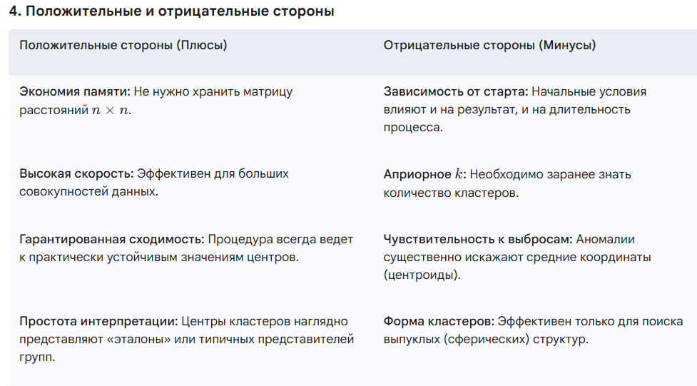

## 33. Метод К – средних в кластерном анализе. Положительные и отрицательные стороны этого метода.

Метод K-средних (K-means) является наиболее популярным методом неиерархической кластеризации. В отличие от иерархических процедур, он не требует вычисления и хранения матрицы расстояний между всеми объектами, а использует только исходные значения переменных.

### 1. Понятие и цель метода

Алгоритм предполагает разбиение совокупности из $n$ объектов на $k$ кластеров таким образом, чтобы минимизировать дисперсию внутри каждого кластера (суммарное квадратичное отклонение точек от центров).

**Математическая цель:** минимизация целевой функции:

$$J = \sum_{i=1}^{k} \sum_{x \in S_i} ||x - \mu_i||^2 \to \min$$

Расшифровка обозначений:

* $k$ — заданное количество кластеров.

* $S_i$ — множество объектов, образующих $i$-й кластер.

* $x$ — вектор признаков конкретного объекта.

* $\mu_i$ — центр тяжести (центроид) $i$-го кластера.

* $||x - \mu_i||^2$ — квадрат Евклидова расстояния от объекта до центра его кластера.

### 2. Алгоритм метода (пошагово)

**Шаг 1.** **Выбор начальных условий.**

* Задается число кластеров $k$.

* Выбираются начальные центры — **эталоны $E_m^{(0)}$** ($m = 1, \dots, k$). Это могут быть случайно выбранные объекты, первые $k$ объектов или точки, заданные исследователем на основе априорных данных (например, после иерархического анализа).

* Каждому эталону приписывается вес $W_m$, равный количеству входящих в него объектов (в начале $W_m = 1$).

**Шаг 2.** **Распределение объектов.**

Определяются расстояния от остальных $(n-k)$ объектов до эталонов (обычно используется Евклидово расстояние). Объект $x_i$ относится к тому кластеру, расстояние до которого минимально. Если минимальных расстояний несколько, объект присоединяют к центру с наименьшим порядковым номером.

**Шаг 3.** **Пересчет центров (Модификации).**
Существует две основные модификации метода:

* **Пересчет после каждого изменения состава:** центр тяжести (среднее по каждому показателю) пересчитывается сразу, как только в кластер добавился один объект.

* **Пересчет после полного просмотра данных:** новые центры вычисляются только после того, как все объекты были распределены по группам.

**Шаг 4.** **Итерационный процесс.**
Процедуры 2 и 3 повторяются до тех пор, пока последующее разбиение не даст такой же состав кластеров, что и предыдущее.

### 3. Сходимость и вспомогательные приемы

При больших объемах данных пересчет эталонных точек $E_m$ практически перестает приводить к их изменению (сходимость при $t \to \infty$). Если устойчивое решение не достигнуто быстро, применяют:

* **«Зацикливание» алгоритма:** повторный прогон через всю выборку (начиная с первой точки), пока результат двух последовательных разбиений не совпадет.

* **Многократное повторение:** использование различных комбинаций начальных эталонов с последующим выбором наиболее часто повторяющихся финальных результатов.

**Резюме для экзамена:** Метод K-средних — это итерационный процесс последовательного уточнения эталонных точек $E_m$ и их весов $W_m$, направленный на поиск наиболее устойчивого разбиения данных при заданном $k$.

### Практические рекомендации для экзамена:

**Стандартизация:** Перед применением метода данные нужно нормировать, иначе признаки с большими значениями (например, доход в рублях против возраста в годах) будут доминировать в расчетах.

**Многократный запуск:** Из-за зависимости от начальных центров рекомендуется запускать алгоритм несколько раз и выбирать вариант с наименьшим значением SSE.

**Локальный минимум:** Важно помнить, что метод находит «достаточно хорошее» решение, но не гарантирует глобальный оптимум.