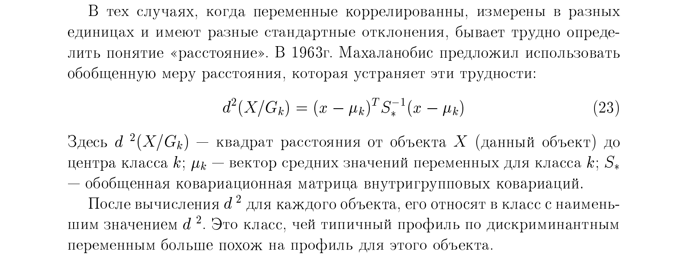
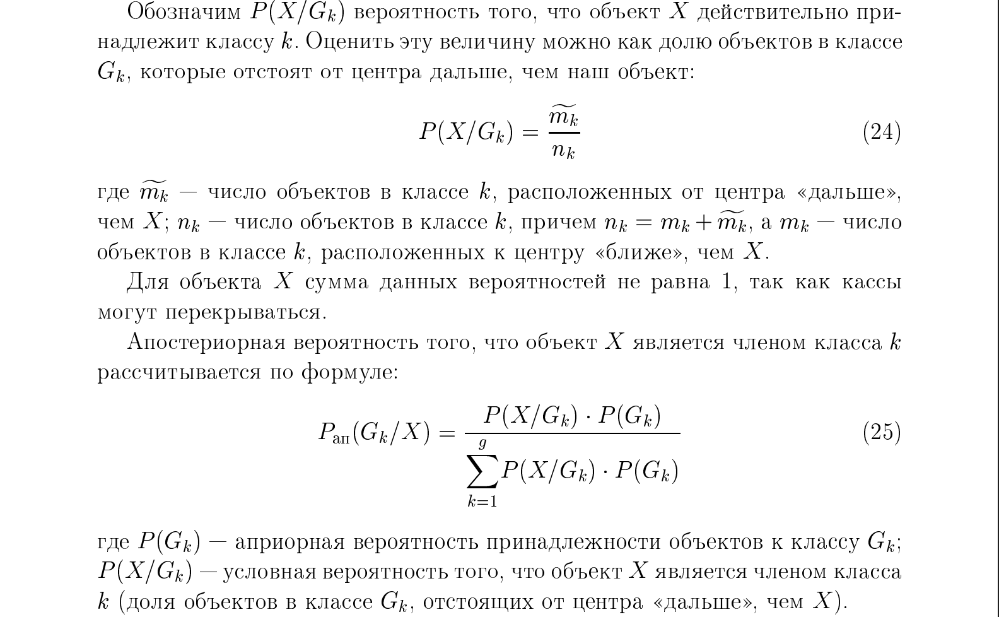
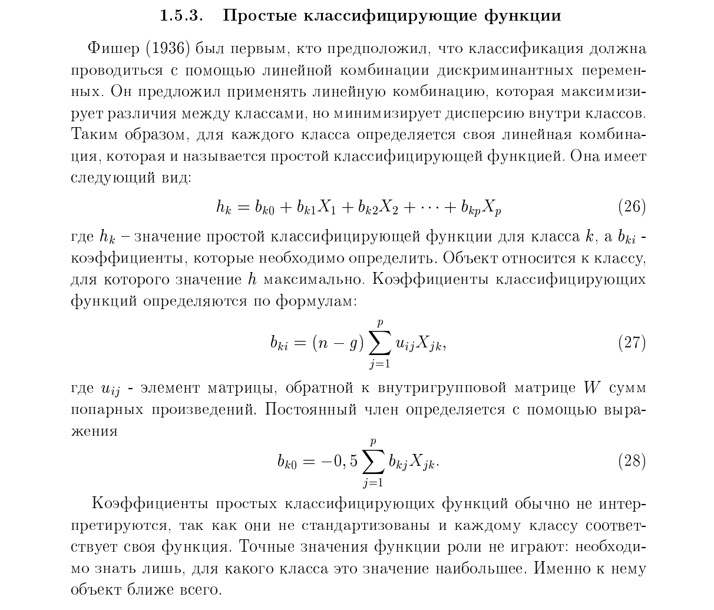

# 37. Дискриминантный анализ. Классификация с использованием вероятностно-статистических методов (расстояние Махаланобиса и апостериорная вероятность). Простые классифицирующие функции и их применение для классификации.

**Дискриминантный анализ** — это раздел многомерного статистического анализа, предназначенный для решения задач классификации объектов в ситуациях, когда **группы (классы) известны заранее**. В отличие от кластерного анализа, этот метод относится к обучению «с учителем», так как строится на основе обучающей выборки, где принадлежность каждого объекта к определенной группе уже определена.

### Расстояние Махаланобиса
**Расстояние Махаланобиса** представляет собой меру близости конкретного объекта к центроиду (средней точке) каждой из известных групп в многомерном пространстве признаков.
    
    
*   **Особенности метрики:** В отличие от обычного евклидова расстояния, расстояние Махаланобиса **учитывает корреляционные связи** между переменными и их разную изменчивость (дисперсии). Это делает его более точным инструментом для анализа сложных статистических данных, где признаки взаимозависимы.
*   **Правило классификации:** Объект относится к той группе, **расстояние Махаланобиса до центра которой минимально**,.
*   **Практическая реализация:** В статистических программах (например, Statistica) результаты часто представляются в виде матрицы квадратов расстояний Махаланобиса от объектов до центров всех выделенных групп.

### Апостериорная вероятность
**Апостериорная вероятность** — это вероятность того, что объект принадлежит к определенному классу, вычисленная **после (post) получения и анализа значений его признаков**.
    

*   **Использование априорных данных:** Для вычисления апостериорных значений необходимо задать априорные вероятности (предположения о частоте классов до начала исследования). Они могут быть:
    1.  **Равными** для всех групп.
    2.  **Пропорциональными** фактическим размерам групп в обучающей выборке.
*   **Правило классификации:** Модель классифицирует объект в ту группу, для которой **апостериорная вероятность является максимальной**,.
*   **Значимость:** Данный подход позволяет не просто распределить объекты, но и оценить степень уверенности в правильности классификации для каждого конкретного случая.

### Суть классифицирующих функций
Классифицирующие функции представляют собой линейные комбинации независимых переменных (признаков), которые позволяют вычислить «показатель близости» объекта к каждой из групп. Для каждого класса $j$ строится свое отдельное уравнение.

**Основная формула функции для группы $j$:**
$$S_j = c_j + w_{1j}x_1 + w_{2j}x_2 + \dots + w_{pj}x_p$$

Где:
*   **$S_j$** — результирующее значение (классификационный показатель) для группы $j$;
*   **$c_j$** — константа для $j$-й группы;
*   **$w_{1j}, \dots, w_{pj}$** — весовые коэффициенты признаков, рассчитанные для данной группы;
*   **$x_1, \dots, x_p$** — фактические значения признаков классифицируемого объекта.

### Применение для классификации
Процесс классификации с использованием этих функций выглядит следующим образом:
1.  **Расчет показателей:** Значения признаков нового объекта ($x_i$) подставляются в уравнения функций для **каждой** из имеющихся групп.
2.  **Сравнение результатов:** Для каждого объекта получается набор значений $S_1, S_2, \dots, S_k$.
3.  **Принятие решения:** Объект относится к той группе, для которой значение классифицирующей функции оказалось **максимальным**.

Математически это означает, что объект имеет наибольшую вероятность принадлежности именно к этой группе.

### Особенности и условия применения
*   **Оценка качества:** Эффективность разделения групп этими функциями проверяется с помощью статистики **Лямбда Уилкса ($\Lambda$)**. Значения $\Lambda$, близкие к 0, указывают на четкое различие между группами, а близкие к 1 — на плохую дискриминацию.
*   **Допущения:** Метод предполагает, что независимые переменные имеют многомерное нормальное распределение, а ковариационные матрицы групп примерно равны.
*   **Практическое использование:** В программных пакетах (например, Statistica) расчет коэффициентов $w_{ij}$ и констант $c_j$ происходит автоматически на основе обучающей выборки.

