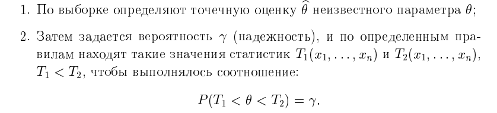

# 8. Понятие интервальной оценки числовой характеристики случайной величины. Доверительная вероятность (надежность). Доверительный интервал. Метод построения интервальной оценки с помощью центральных статистик.

Точечная оценка даёт нам лишь приближенное значение, т.е вероятность того, что оценка параметра совпадает с его истинным значением никогда не равна 1

Если для больших выборок это ещё ок, вероятность стремиться к одному (свойство состоятельности), то для маленьких не всё так радужно

поэтому делают следующим образом

### ОПР (интервальной оценки)

**Интервальная оценка параметра $\theta$** - это числовой интервал $(T_1, T_2)$, в котором с заданной вероятность $\gamma$ находится параметр $\theta$

Границы T_1 и T_2 определяются по выборочным данным(случайным точкам), то они тоже будут случайными величиными. Кроме того границы также зависят от $\gamma$
* с **ростом** $\gamma$ **длина интервала увеличивается**, с **уменьшением** **уменьшается**

### ОПР (довертильного интервала и вероятности)

$(T_1, T_2)$ - это доверительный интервал, а $\gamma$ - доверительная вероятность(надежность)

Интервальная оценка должна удовлетворять следующим требованиям:
1. Должна быть точной, т.е ширина интервала $\Delta = \frac{(T_1-T_2)}{2}$ должна быть как можно меньше
2. $\gamma$ должна принимать высокие значения, обычно берут всё что больше 0.9

Также вводят понятие уровня значимости $\alpha$. Математически он равен 1 - $\gamma$, по сути обозначает вероятность ошибки оценки, т.е **вероятность, с которой оцениваемый параметр в интервале не находится**

## Как искать интервалы

интервалы ищут с помощью центральной статистики и магии

### ОПР(центральной статистики)

$W(x, \theta)$- центральная статистика, если:
1. $W(x, \theta)$ строго монотонная функция и она непрерывна по $\theta$
2. $F_{W}(x)$ - функция распределения W не зависит от параметра $\theta$

### ОПР(Квантиль)

число $z_{\gamma}$ - называют $\gamma$-квантилем распределения F(x),если выполняется условие F($z_{\gamma}$) = $\gamma$

по сути $z_{\gamma}$ - обозначает правый конец интервала (-$\infin$, $z_{\gamma}$), в который попадёт точка с вероятность $\gamma$

вычислять квантили можно с помощью обратной функции распределения(ищи её в экселе, юпитере, статистике)

### Зная всё это добро сможем найти границы следующим образом

$$P(T_1 < W(x,\theta)) = \gamma = 1- \alpha$$
$$1 - P(T_1 < W(x,\theta)) = 1- \gamma = \alpha = P(W(x,\theta) < T_1)$$

ну и всё зная функцию распределения $W(x, \theta)$ - $F_{W}(x)$ находим теперь $\alpha$-квантиль он и будет левой границей $T_1$

Поступаем аналогично и находим другой конец интервала. STONKS

Вероятность не попасть в интервал ($T_1, T_2$) равна $\alpha$. Предполагают, что вероятность оказаться левее или правее одинакова и составляет $\frac{\alpha}{2}$.
Т.к $1-\alpha = \gamma$, то :
* $\frac{\alpha}{2} = \frac{1-\gamma}{2}$ 
* $1 - \frac{\alpha}{2} = \frac{1+\gamma}{2}$ 

поэтому можно записать так:

$$P(z_{\frac{1-\gamma}{2}} < W(x,\theta) < z_{\frac{1+\gamma}{2}}) = \gamma$$

### Замечание
Если у распределения плотность распределния симетрична относительно оси ординат, то квантили тоже будут симетричными $z_{\gamma} = z_{1-\gamma}$

Иногда интервал выбирают симметрично относительно какой-то оценки параметра $\theta$, т.е $(\theta - \Delta, \theta + \Delta)$

здесь $\Delta$ - это абсолютная погрешность оценки

