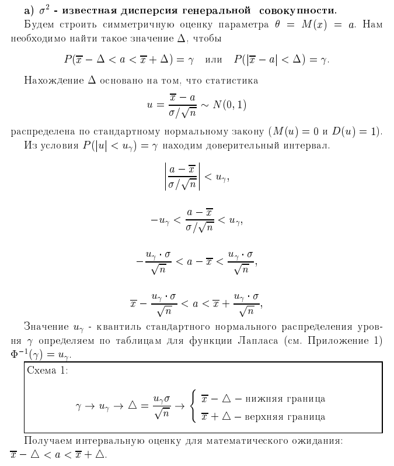
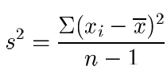
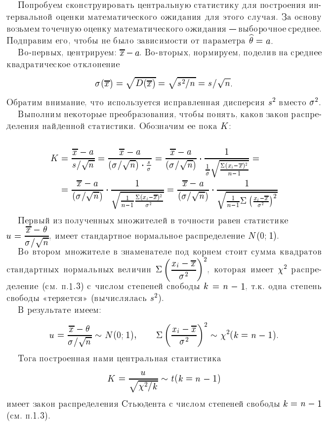
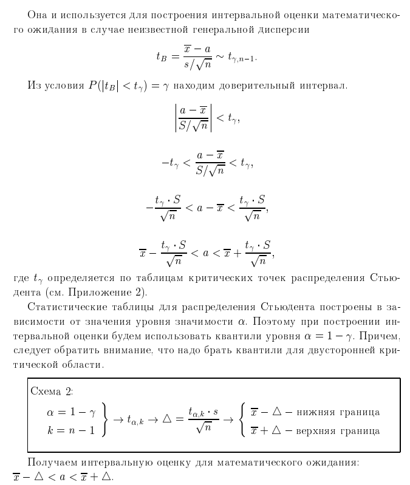
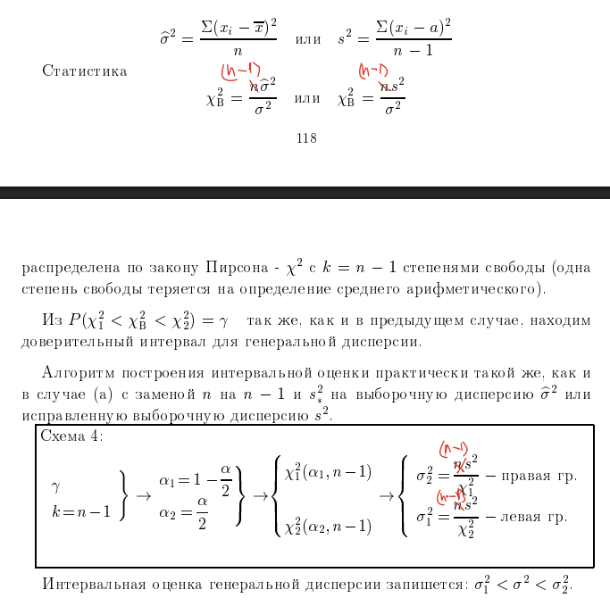
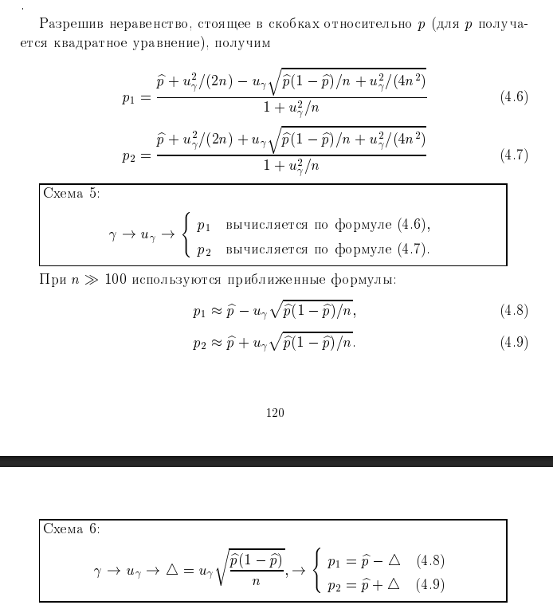
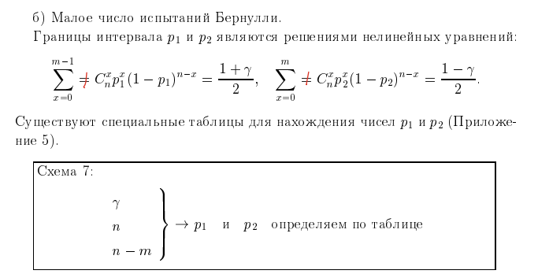

# 9. Интервальные оценки параметров нормального распределения: математического ожидания, генеральной дисперсии, генеральной доли (3 отдельных вопроса).

**Интервальной оценкой** называется оценка, определяемая двумя числами — концами интервала, который с заданной точностью (надежностью) накрывает оцениваемый параметр. 

## 1. Интервальная оценка математического ожидания

Для математического ожидания $a$ нормального распределения $N(a, \sigma)$ метод построения доверительного интервала зависит от того, известна ли генеральная дисперсия $\sigma^2$.

### Случай 1: Генеральное среднее квадратическое отклонение $\sigma$ известно
В этом случае используется статистика, имеющая **стандартное нормальное распределение** $N(0, 1)$.
Доверительный интервал строится по формуле:
$$ \bar{x} - u_{\gamma} \frac{\sigma}{\sqrt{n}} < a < \bar{x} + u_{\gamma} \frac{\sigma}{\sqrt{n}} $$
Где:
*   $\bar{x}$ — выборочное среднее.
*   $n$ — объем выборки.
*   $u_{\gamma}$ — квантиль, определяемый из уравнения $\Phi^{-1}({\gamma}) = u_\gamma$ (где $\Phi^{-1}(\gamma)$ — обратная функция Лапласа, а $\gamma$ — доверительная вероятность).

### Случай 2: Генеральное среднее квадратическое отклонение $\sigma$ неизвестно
Если $\sigma$ неизвестна, вместо нее используется **исправленное выборочное среднее квадратическое отклонение** $s$. Соответствующая статистика имеет **распределение Стьюдента** с числом степеней свободы $k = n - 1$.

Доверительный интервал строится по формуле:
$$ \bar{x} - t_{\gamma} \frac{s}{\sqrt{n}} < a < \bar{x} + t_{\gamma} \frac{s}{\sqrt{n}} $$
Где $t_{\gamma}$ — критическая точка распределения Стьюдента, найденная по таблице для заданного уровня значимости $\alpha = 1 - \gamma$ и $k$ степеней свободы.

---

## 2. Интервальная оценка генеральной дисперсии

Для построения доверительного интервала генеральной дисперсии $\sigma^2$ используется статистика, имеющая **распределение $\chi^2$ (хи-квадрат) Пирсона**.

### Случай 1: Математическое ожидание $a$ известно
Используется статистика $\chi^2 = \frac{ns^2_*}{\sigma^2}$ с $k = n$ степенями свободы, где $s^2_* = \frac{\sum (x_i - a)^2}{n}$.
Доверительный интервал:
$$ \frac{ns^2_*}{\chi^2_2} < \sigma^2 < \frac{ns^2_*}{\chi^2_1} $$
Где $\chi^2_1$ и $\chi^2_2$ — квантили распределения $\chi^2$.

### Случай 2: Математическое ожидание $a$ неизвестно
В этом случае используется статистика $\chi^2 = \frac{(n-1)s^2}{\sigma^2}$ с числом степеней свободы $k = n - 1$.
Формула доверительного интервала:
$$ \frac{(n-1)s^2}{\chi^2_{2}} < \sigma^2 < \frac{(n-1)s^2}{\chi^2_{1}} $$
Где:
*   $s^2$ — исправленная выборочная дисперсия.
*   $\chi^2_1 = \chi^2(1-\alpha/2; n-1)$ и $\chi^2_2 = \chi^2(\alpha/2; n-1)$ — квантили распределения хи-квадрат, определяемые по таблицам.

---

## 3. Интервальная оценка генеральной доли

Точечной оценкой генеральной доли $p$ является выборочная доля $\hat{p} = \frac{m}{n}$.

### Случай 1: Большой объем выборки ($np > 10$)
Для построения интервала используется нормальная аппроксимация. При $n \ge 100$ границы интервала определяются приближенными формулами:
$$ p_1 = \hat{p} - u_{\gamma} \sqrt{\frac{\hat{p}(1-\hat{p})}{n}} $$
$$ p_2 = \hat{p} + u_{\gamma} \sqrt{\frac{\hat{p}(1-\hat{p})}{n}} $$
При меньших объемах выборки ($n < 100$) используются более точные формулы, основанные на решении квадратного уравнения относительно $p$:
$$ p_{1,2} = \frac{\hat{p} + \frac{u_{\gamma}^2}{2n} \mp u_{\gamma} \sqrt{\frac{\hat{p}(1-\hat{p})}{n} + \frac{u_{\gamma}^2}{4n^2}}}{1 + \frac{u_{\gamma}^2}{n}} $$

### Случай 2: Малый объем выборки
Когда число испытаний невелико, границы $p_1$ и $p_2$ определяются как решения нелинейных уравнений на основе биномиального распределения или находятся по специальным таблицам.

---
**Аналогия:**
Интервальная оценка — это своего рода «сеть». Если точечная оценка — это попытка угадать точный вес рыбы (одно число), то интервальная оценка — это заявление, что вес рыбы находится в диапазоне от 500 до 600 граммов. 
• Доверительная вероятность ($γ$) — это прочность сети (насколько мы уверены, что рыба внутри).
• Дисперсия и объем выборки определяют размер сети: чем больше неопределенность (дисперсия) и меньше попыток (выборка), тем шире должна быть «сеть» (интервал), чтобы гарантированно поймать результат.